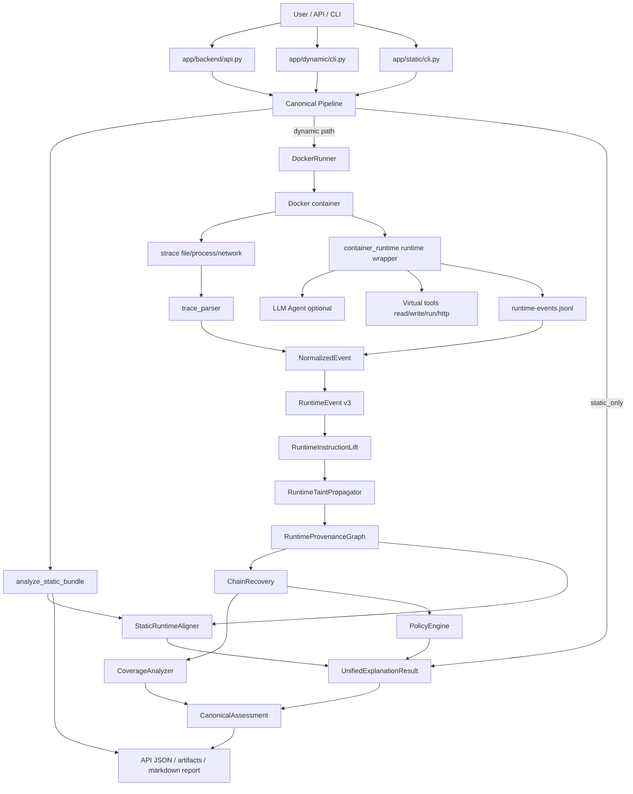

# ProvLoom 当前版本系统说明

更新日期：2026-07-29

本文只描述当前仓库代码中实际存在的实现，不把 README、设计目标或历史方案当作事实来源。

## 结论速览

ProvLoom 目前包含报告生成功能，并且 hardening 后主入口已统一到 canonical pipeline：

- Canonical pipeline 位于 `app/analysis/pipeline.py:50-152`，顺序是 Static v2 -> optional Docker runtime -> normalized events -> Dynamic v3 -> UnifiedExplanationResult -> CanonicalAssessment -> API/CLI/batch/report。
- API 返回结构化 JSON 报告，包含 `risk_score`、`risk_level`、`canonical_risk_score`、`canonical_final_decision`、runtime graph、chains、coverage certificate、policy findings、static fields、unified report paths 等。证据：`app/backend/api.py:70-91`，响应 schema 在 `app/backend/schemas.py:141-201`。
- Dynamic CLI 复用 canonical pipeline，并支持从 `unified-analysis.json` 导出 JSON 或 Markdown。证据：`app/dynamic/cli.py:68-111`、`app/dynamic/cli.py:123-134`。
- Static CLI 会写 `static-analysis.json`、`static-explanation.md`、`instruction-provenance-graph.json`，并额外写 unified JSON/Markdown。证据：`app/static/cli.py:74-106`。
- 独立 Markdown 报告器 `app/reporting/skill_report.py` 可以把单个 skill scan JSON 转成确定性 Markdown 报告，脚本入口是 `scripts/generate_skill_report.py`，批量扫描也会调用它。证据：`app/reporting/skill_report.py:35-65`、`app/reporting/skill_report.py:1144-1158`、`scripts/batch_scan_skills.py:1264-1269`。
- 统一 Markdown 报告器位于 `app/reporting/unified_report.py:11-80`，API/CLI/batch/benchmark 共同使用 `UnifiedExplanationResult` 作为输入。

最终输出有风险评分。主 API 动态路径中，`AnalyzeSkillResponse.risk_score` 是顶层字段，`risk_level` 由 `map_risk_profile()` 将分数映射为 low/medium/high/critical。证据：`app/backend/api.py:121-146`、`app/reporting/risk_mapper.py:51-70`。Dynamic v3 canonical assessment 会在需要时覆盖 legacy score，使顶层 `risk_score` 等于 `canonical_risk_score`。证据：`app/dynamic/assessment.py:130-160`。

当前系统总体属于“Static v2 instruction provenance + Dynamic v3 evidence-graded runtime provenance + carrier-aware taint + static-runtime reconciliation + obligation-based coverage certificate”的混合分析器。

## 架构图



## 入口与报告输出

### API 主路径

`app/backend/api.py` 的当前路径是：

1. 接收 `AnalyzeSkillRequest`。
2. 调用 `analyze_skill_bundle()`。
3. `analysis_mode=static_only` 调用 Static v2 `analyze_static_bundle()`，不再走 legacy static 主结果。
4. dynamic 模式先 Static v2，再 Docker runtime，再 Dynamic v3。
5. 构建 UnifiedExplanationResult、CoverageCertificate、PolicyFinding、CanonicalAssessment。
6. 写 `unified-analysis.json`、`unified-explanation.md`、`canonical-analysis-result.json`。
7. 构造 `AnalyzeSkillResponse`。

代码证据：`app/backend/api.py:70-91`、`app/analysis/pipeline.py:50-152`。

### Dynamic CLI

`provloom dynamic run` 运行 Docker sandbox，随后执行 Static v2、normalization、Dynamic v3、`analyze_trace()` 和 `build_execution_report()`，但 CLI stdout 只打印摘要字段，不打印完整 `risk_score`。证据：`app/dynamic/cli.py:70-121`。

Dynamic v3 artifacts 固定写入：

- `runtime-events-v2.jsonl`
- `runtime-provenance-graph.json`
- `runtime-chains.json`
- `dynamic-analysis.json`

证据：`app/dynamic/analyzer.py:165-180`。

`provloom dynamic export --format md` 只输出覆盖状态和 chain explanations，是简略解释，不是完整审计报告。证据：`app/dynamic/cli.py:131-140`。

### Static CLI

`provloom static run` 调用 Static v2 `analyze_static_bundle()`，写入 `static-analysis.json`、`static-explanation.md`、`instruction-provenance-graph.json`。证据：`app/static/cli.py:74-111`。

Static CLI stdout 输出 `review_priority`、chain/status/alert 计数和 coverage states，不输出 numeric `risk_score`。证据：`app/static/cli.py:85-100`。

### 独立 Markdown 报告器

`app/reporting/skill_report.py` 是 deterministic Markdown report generator。它读取一个 JSON scan result，生成“Single-Skill Evidence Explanation Report”，包含 executive verdict、flag reason、evidence type、chain explanation、runtime evidence、instruction evidence、risk findings、recommendations、machine-readable summary 等章节。证据：`app/reporting/skill_report.py:35-65`、`app/reporting/skill_report.py:100-130`。

这个报告器不是 API 主路径自动调用的 HTML 生成器；它通过 `scripts/generate_skill_report.py` 或 batch scan 调用。证据：`scripts/generate_skill_report.py:1-15`、`scripts/batch_scan_skills.py:1264-1269`。

## 风险评分与判定

### Dynamic v3 canonical score

Dynamic v3 使用 `CanonicalAssessment` 将 runtime evidence 映射到最终顶层决策：

- `policy_violations` 非空：`canonical_final_decision="malicious"`，`canonical_risk_score=80`。
- coverage 属于 timeout、execution_failed、path_not_triggered、source_unavailable、environment_missing、unsupported_operation、sink_unavailable：`canonical_final_decision="needs_review"`，`canonical_risk_score=30`。
- coverage 是 instrumentation_gap、insufficient_coverage，或存在 candidate chain、instruction_simulated、hash-only chain：`needs_review`，分数 30。
- 没有 violation、没有需要 review 的 evidence：`benign`，分数 0。

证据：`app/dynamic/assessment.py:9-12`、`app/dynamic/assessment.py:34-127`。

`apply_canonical_assessment()` 会保留 `legacy_risk_score`/`legacy_final_decision`，但把顶层 `risk_score` 和 `final_decision` 改成 canonical 结果。证据：`app/dynamic/assessment.py:130-160`。

### Legacy runtime/rule score

`analyze_trace()` 先根据 observed behaviors、EPG、decision engine 计算 legacy `risk_score`，随后在 Dynamic v3 条件满足时被 canonical 覆盖。证据：`app/analyzer/rules.py:104-126`、`app/analyzer/rules.py:211-231`。

风险等级映射：

- 0-19：low / 低风险
- 20-49：medium / 中风险
- 50-79：high / 高风险
- 80-100：critical / 严重风险

证据：`app/reporting/risk_mapper.py:51-70`、`app/reporting/risk_mapper.py:114-118`。

### Static-only legacy score

API 的 `analysis_mode=static_only` 使用 `analyze_static_skill()`，不是 Static v2 graph pipeline。它对 skill definition action type 做行为命中：`http_request`、`run_command`、`write_file`、`read_file` 等；每个 detected behavior 20 分，`min(100, len(detected)*20)`。证据：`app/analyzer/rules.py:318-341`、`app/analyzer/rules.py:425-475`。

### Static v2 review priority

Static v2 本身输出 `static_analysis_summary.review_priority`、`static_chains[*].alert_status`、`policy_status`、`review_priority` 等解释级字段，不是 numeric risk score 体系。证据：`app/static/static_report.py:25-57`、`app/static/static_report.py:254-290`。

## 静态分析原理

Static v2 是基于 instruction artifacts 的静态语义分析管线，schema 是 `provloom-static-v2`。证据：`app/static/artifact_schema.py:7`。

### 数据模型

核心对象：

- `StaticArtifact`：文件级 artifact，含 path、type、sha256、size、encoding、load_status。
- `SemanticUnit`：文档/代码切分后的语义单元，含 unit type、行号范围、offset、text、parent_section、language。
- `StaticAction`：规范化动作，含 actor、action_type、source/object/destination/tool/result mentions、modality、evidence span、extractor、grounding_status、confidence。
- `StaticChain`：静态风险链，含 chain_type、status、review_priority、source/sink、ordered_nodes/edges、limitations、capability_type、policy_status、alert_status、data/scope continuity。
- `StaticCoverage`：静态 coverage states 和加载/解析/grounding/实体解析统计。

证据：`app/static/artifact_schema.py:10-64`、`app/static/action_schema.py:7-54`、`app/static/path_validator.py:27-61`。

### 管线

`analyze_static_bundle()` 实现顺序：

1. `ArtifactLoader` 载入 skill root 中的候选文件。
2. `SemanticUnitParser` 切分 semantic units。
3. `DeterministicStaticExtractor` 抽取 mentions 和 deterministic actions。
4. `SpanGroundedLLMActionExtractor` 可选做 span-grounded LLM action extraction。
5. `ActionNormalizer` 归一化 action。
6. `GroundingValidator` 校验证据是否能落回 artifact/unit/span。
7. `EntityResolver` 解析实体。
8. `InstructionGraphBuilderV2` 构建 instruction provenance graph。
9. `StaticPathValidator` 恢复静态风险链。
10. 生成 `StaticCoverage` 和 summary。

证据：`app/static/static_report.py:86-161`。

### 文件加载与边界

静态加载器有大小、深度、文件数、扩展名和 ignore pattern 限制。默认忽略 `.git/**`、`.provloom/private/**`、credential state、node_modules、dist/build/vendor、artifacts 等。证据：`app/static/static_config.py:10-43`、`app/static/artifact_loader.py:16-53`。

### 静态 action 与 modality

Action type 包括 READ、WRITE、COPY、MOVE、DELETE、DOWNLOAD、UPLOAD、SEND、EXECUTE、INSTALL、IMPORT、DECODE、EXTRACT、MODIFY、PERSIST、REQUEST_PERMISSION、ACCESS_CREDENTIAL、INVOKE_TOOL、INVOKE_API、REGISTER_SERVICE、CHANGE_PERMISSION、COLLECT、TRANSFORM 等。Modality 包括 required、recommended、optional、conditional、prohibited、example_only、descriptive、hypothetical、quoted_untrusted、unknown。证据：`app/static/action_schema.py:7-13`。

`StaticPathValidator` 会过滤 suppressed modalities，例如 prohibited、example_only、hypothetical、quoted_untrusted、descriptive，避免把示例或禁止事项直接当作闭合恶意链。证据：`app/static/path_validator.py:17`、`app/static/path_validator.py:69-89`。

### 静态风险链模板

Static v2 恢复的主要风险链包括：

- credential paths：敏感读取/凭据访问/收集，到本地暴露或外部 SEND/UPLOAD/API。
- download_execute：包管理器安装、下载后执行、pipe-to-shell。
- dropper/multistage execution：下载、解压/解码、执行。
- persistence、destructive modification、permission expansion、reverse shell、ransomware、resource abuse、instruction policy 等。

证据：`app/static/path_validator.py:69-89`、`app/static/path_validator.py:91-152`、`app/static/path_validator.py:154-170`。

### 静态策略分类

`PolicyClassifier` 使用 path status、capability type、trust assessment、limitations、unresolved/conditions 将链分为 expected/trusted/capability_only/review/violation 等。典型高危 capability 包括 credential_exfiltration、untrusted_download_execute、privilege_escalation、reverse_shell、ransomware、resource_abuse、malware_delivery、persistence_write、destructive_modification、instruction_override 等。证据：`app/static/policy_classifier.py:20-127`、`app/static/policy_classifier.py:129-149`。

## 动态分析原理

Dynamic v3 是 runtime evidence graph 分析器，schema 是 `runtime-analysis-v3`。证据：`app/dynamic/models.py:8`。

### Sandbox 与 runtime wrapper

`DockerRunner.run()` 会：

- 解析 skill path，加载 skill definition。
- 把 skill 拷贝到临时目录并 mount 到容器 `/workspace/skill`。
- 把 artifacts 目录 mount 到 `/artifacts`。
- 写入 `input-payload.json` 和 `llm-config.json`。
- 运行 Docker，设置 `--cap-drop ALL`、`no-new-privileges`、`--pids-limit 64`、memory limit、`--cpus 1.0`。
- 只有 `network_policy=="disabled"` 时才加 `--network none`；默认网络是真实开放。

证据：`app/runner/docker_runner.py:57-118`、`app/runner/docker_runner.py:153-179`。

容器内部执行：

```text
strace -ff -tt -s 256 -o /artifacts/trace.log -e trace=file,process,network
python -m app.runtime.container_runtime ...
```

证据：`app/runner/docker_runner.py:374-392`。

执行结束后读取 meta/stdout/stderr，解析 strace，清理敏感 LLM config 和 trace payload artifacts，加载 runtime tool/LLM events。证据：`app/runner/docker_runner.py:229-236`。

### Runtime wrapper 与 LLM agent

`container_runtime.py` 暴露 virtual tools：`read_file`、`write_file`、`run_command`、`http_request`。证据：`app/runtime/container_runtime.py:154-222`。

`run_command` 使用 `subprocess.run(cwd=skill_root, capture_output=True, text=True)` 执行命令；`http_request` 使用 `urllib.request` 发起请求。证据：`app/runtime/container_runtime.py:253-301`。

如果 LLM enabled 或 skill runtime 属于 LLM agent 类，`ProvLoomSkillRuntime.execute()` 调用 `LLMAgentSkillRuntime`；否则顺序执行 skill definition 中的 actions。证据：`app/runtime/container_runtime.py:586-618`。

LLM agent 每轮记录 LLM request/response、执行工具、将 tool result 作为下一轮 user message。证据：`app/runtime/container_runtime.py:671-745`。LLM request metadata 记录 provider/model/base_url/message_count/taint context，不保存完整 prompt 明文；带 taint 的 context 只记录 sha256、byte_count 和 redacted preview。证据：`app/runtime/container_runtime.py:802-841`。

### Trace parser 与 normalized events

`trace_parser.py` 解析 strace 产生：

- file events：open/openat/openat2 作为 read/write/create，unlink/rename 作为 delete_or_rename。
- process events：execve/clone/vfork/fork。
- network events：connect、send/sendto/sendmsg/sendmmsg、socket fd write。

证据：`app/runner/trace_parser.py:24-51`、`app/runner/trace_parser.py:54-82`、`app/runner/trace_parser.py:92-185`。

`build_normalized_events()` 将 LLM、tool、process、file、network、data-flow hints、taint events 合并成统一 `NormalizedEvent`，并按 timestamp/event_id 排序。证据：`app/telemetry/normalizer.py:42-67`。

`build_data_flow_hints()` 会在敏感读和网络事件共现时生成 candidate dependency，文本明确说明这不是确认数据流。证据：`app/telemetry/collector.py:67-97`。

### RuntimeEvent v3 数据模型

`RuntimeEvent` 字段覆盖事件 id、timestamp、event_type、process_id、parent_process_id、session_id、skill_id、actor/object、operation、data preview/hash、byte count、taint ids、evidence level、raw source/reference、evidence strength、observation source、carrier type/location、hash-derived、instrumentation visibility、trace reference、metadata。证据：`app/dynamic/models.py:62-100`。

`event_schema.py` 将 normalized events 转成 RuntimeEvent：

- file → `file_<operation>`，carrier 是 file_content 或 file_path。
- network → `network_<operation>`，object 是 `NET:<sink_url/address>`，carrier/evidence 由 network metadata 决定。
- process → `process_exec`，carrier 是 process_argv。
- tool_call → `tool_invoke` 或 `tool_return`。
- LLM request 只有当有 taint ids 时转成 `llm_request`。
- taint_source → `sensitive_source`。

证据：`app/dynamic/event_schema.py:86-103`、`app/dynamic/event_schema.py:106-257`。

### Marker 与 taint source

`TaintRegistry` 生成 synthetic marker，格式为 `PROVLOOM_SECRET_<taint_id>_<entropy>`。默认 entropy 是 8 bytes，即 16 hex chars。它维护 raw、base64、hex、url_encoded、json_escaped、sha256 variants；sha256 被标记为 derived，evidence level 是 conservative。证据：`app/dynamic/marker_registry.py:24-67`、`app/dynamic/marker_registry.py:91-111`。

动态敏感路径默认包括 `/etc/passwd`、`/etc/shadow`、`/root/**`、`/workspace/skill/.provloom/private/**`、`.provloom/adapters/credential_state/**`。证据：`app/dynamic/config.py:51-60`。

### 污点传播

`RuntimeTaintPropagator.propagate()` 按时间顺序处理 RuntimeEvent，先用 marker variants 丰富事件，再套规则；如果没有具体 network flow，会补 candidate dependency。证据：`app/dynamic/propagation.py:41-50`。

已实现规则：

- sensitive_source → file taint。
- sensitive file read/path match → register source，file taint，process input taint。
- read tainted file → event taint + process input taint。
- write file：若事件显式带 taint，则 taint 目标文件；若只是 process context 且 metadata `output_from_tainted_input`，只加 context，不确认污染；否则清除目标 file taint。
- file derivation：copy/move/rename/extract 继承源文件 taint。
- process exec：从 argv/env/stdin/command 中检测 marker；只有 `passes_file_content` 且源文件强证据时才把文件 taint 作为 argv taint，否则加 process context。
- ipc：pipe/stdin/stdout/stderr 规则，带 data preview/taint 时确认，否则 candidate context。
- tool invoke/return：传播 input/output taint refs。
- network send/upload：显式 upload_file 或 body/headers/query/socket_payload/tool_arguments/json_body/form/multipart 中 marker 可传播；opaque payload after prior sensitive process contact 只加 context。

证据：`app/dynamic/propagation.py:52-180`。

重要语义：当前实现不是“进程读过敏感源后所有输出均 confirmed tainted”。它把 prior contact 记为 `context_taint_ids`，证据强度是 `process_context`，level 至多 candidate。证据：`app/dynamic/propagation.py:102-113`、`app/dynamic/propagation.py:176-180`、`app/dynamic/propagation.py:242-258`。

### Provenance graph

`RuntimeGraphBuilder` 将 RuntimeEvent 构成 `RuntimeProvenanceGraph`：

- 节点类型包括 SensitiveSource、Process、File、NetworkEndpoint、AgentSession、ToolInvocation、DataObject、RuntimeInstruction、PersistenceTarget。
- 边类型由 operation 映射：READ、WRITE、EXEC、FORK、PIPE、PASS_AS_ARGUMENT、PASS_AS_ENV、RETURN_TO、CONTROL_TRIGGER、SEND、CONNECT、UPLOAD_FILE、PERSIST、MATERIALIZE_INSTRUCTION、DERIVE、EXTRACT 等。
- 对 tainted carrier 创建 DataObject，并连 DERIVES/PROPAGATES/SENDS/UPLOADS 等边。
- 对 process context 创建 HAS_PROCESS_CONTEXT 弱边。
- 对 read-before-connect candidate 创建 CO_OCCURS 弱边。
- 边按 source/target/type/carrier 去重，并聚合 event ids、taint ids、raw references、timestamps、instrumentation gaps。

证据：`app/dynamic/graph.py:9-30`、`app/dynamic/graph.py:33-49`、`app/dynamic/graph.py:51-139`、`app/dynamic/graph.py:187-227`。

### Risk chain recovery

`ChainRecovery` 用 BFS 从 SensitiveSource 搜索到终端边/节点：

- confirmed confidentiality terminal：SENDS、UPLOADS，到 NetworkEndpoint。
- candidate confidentiality terminal：CONNECT、CO_OCCURS、HAS_PROCESS_CONTEXT 以及 legacy SEND/UPLOAD_FILE。
- execution confirmed：remote_artifact 写入/派生/解压到 EXEC。
- persistence confirmed：PERSIST、MATERIALIZE_INSTRUCTION。
- instruction simulated：MATERIALIZE_INSTRUCTION 到 RuntimeInstruction。

最大路径长度是 8，BFS 保持时间单调，按弱边/证据强度/数据边/长度排序选最优路径。证据：`app/dynamic/chain_recovery.py:10-51`、`app/dynamic/chain_recovery.py:53-89`、`app/dynamic/chain_recovery.py:118-150`。

confirmed confidentiality 不能包含 hash_derived、process_context、temporal_cooccurrence、candidate、unknown 等弱证据。candidate chain 需要潜在 carrier。证据：`app/dynamic/chain_recovery.py:14-29`、`app/dynamic/chain_recovery.py:80-85`。

chain 会记录 ordered nodes/edges、supporting events、taint ids、evidence level、missing observation points、coverage status、evidence strengths、raw references、transformations、confidence、minimal witness。证据：`app/dynamic/models.py:221-244`、`app/dynamic/chain_recovery.py:153-207`。

### Coverage

`CoverageAnalyzer` 的核心状态：

- timeout：runtime timed out。
- execution_failed：analysis error 或非 0 exit code。
- runtime_confirmed：confirmed/conservative confirmed chain 且无 missing observations。
- instrumentation_gap：confirmed chain 有 missing，或 tainted sink visibility gap。
- insufficient_coverage：candidate dependency、runtime instruction simulated、或有 events 但未闭合 canonical flow。
- path_not_triggered：没有 runtime events。
- target_reached_no_flow：观察到 action/instrumentation，但没有支持的 sensitive flow chain。

证据：`app/dynamic/coverage.py:7-68`。

### Policy

`PolicyEngine` 只把满足条件的 confirmed chain 升级为 violation：

- `confidentiality_confirmed` 且 sink 不被允许：confidentiality violation。
- `persistence_confirmed`：integrity violation。
- `exec` 且 executable 不在 allowlist：integrity violation。

证据：`app/dynamic/policy.py:10-63`。

Confidentiality confirmed chain 如果存在 instrumentation gaps、hash-derived flow、trusted sink、trusted LLM context、trusted auth header、permitted source-sink pair，则不判 violation。证据：`app/dynamic/policy.py:65-123`。

Auth header 会区分 trusted authentication 和 credential exposure/exfiltration：Authorization/Cookie header 到 trusted sink 是 authentication，否则可能是 exposure/exfiltration。证据：`app/dynamic/policy.py:93-142`。

### Static-runtime alignment

`StaticRuntimeAligner` 将 runtime graph items 和 static items 做 key matching，输出 aligned、partially_aligned、runtime_only，并检测矛盾，如静态没有网络而 runtime 有 confirmed network flow，或 runtime endpoint 与静态 URL endpoint 不匹配。证据：`app/dynamic/alignment.py:38-106`、`app/dynamic/alignment.py:225-270`。

## 当前能力与边界

已实现：

- Static v2 instruction provenance、span-grounded action、entity resolution、static chain validation、static coverage。
- Docker sandbox + runtime wrapper + strace file/process/network。
- LLM agent runtime，支持 instruction-heavy skill 通过 virtual tools 执行。
- RuntimeEvent v3、marker variant detection、carrier-aware taint propagation。
- Runtime provenance graph、BFS chain recovery、coverage state、policy decision。
- API JSON 报告、CLI artifacts、Static Markdown、单 skill JSON Markdown report。
- 顶层风险评分和 canonical/legacy 双字段。

部分实现或有明显边界：

- Dynamic CLI stdout 摘要没有直接打印 `risk_score`；完整风险分在 API 响应、`analyze_trace()` 报告字典、batch/log JSON 或自定义保存的 JSON 中。
- Dynamic CLI Markdown export 很简略，只列 coverage 和 chains。
- API 动态路径持久化 Dynamic v3 artifacts，但没有直接调用 `generate_report_file()` 生成 Markdown。
- strace 对 TLS payload 只能看到加密/低层 socket 片段，不能稳定恢复 HTTP method/header/body，除非走 runtime wrapper `http_request` metadata。
- `connect()` 和 read-before-connect 只能形成 candidate dependency，不应等同于确认外传。
- `/root/**` 默认敏感源模式很宽，可能把 pip/cache/runtime 内部文件当成 sensitive source，产生 candidate false positive。
- Static v2 的 review_priority 与 legacy numeric risk_score 是两套评分/解释体系，API static_only 走 legacy 简化规则而不是 Static v2 summary。

## 当前版本一句话描述

ProvLoom 当前版本是一个面向 Skill 的混合证据分析系统：静态侧做 span-grounded instruction provenance graph 与模板化风险链验证，动态侧在 Docker sandbox 内结合 runtime wrapper 与 strace 生成 RuntimeEvent v3，执行 carrier-aware taint propagation、runtime provenance graph 构建、BFS 风险链恢复、coverage 归因和策略判定，最后通过 canonical assessment 输出 `benign`、`needs_review` 或 `malicious` 以及顶层风险分。
