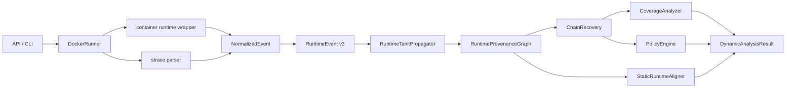

# ProvLoom Dynamic Analysis v3

## Architecture

## RuntimeEvent Schema

`RuntimeEvent` keeps all v2 fields and adds v3 evidence fields:

- `evidence_strength`: exact value, encoded value, explicit file identity, process context, temporal co-occurrence, hash-derived, or unknown.
- `observation_source`: runtime wrapper, strace syscall, inferred relation, instruction simulation, or static alignment.
- `carrier_type` / `carrier_location`: file content/path, argv/env/stdin/stdout, tool argument/return, HTTP header/query/body/form/multipart, upload file, socket payload, LLM/instruction text.
- `derived_from_hash`: marks hash-only observations so policy does not treat them as raw secret exfiltration.
- `instrumentation_visibility`: observed, endpoint-only, payload preview observed, payload not observed, or encrypted payload invisible.
- `raw_event_id`, `trace_file`, `trace_line`, `raw_reference`: raw evidence anchors.

`RuntimeEvent.from_dict()` loads old v2 JSON by filling v3 defaults. `RuntimeEventFactory.create()` now preserves `object_type` before fallback ID generation, so file events get `FILE:/path` rather than `VALUE:/path`.

## DataObject / Carrier Model

The graph still emits legacy File/Process/Tool/Network nodes, but v3 adds carrier-aware `DataObject` nodes:

`SensitiveSource -> DataObject -> Process/Tool/File/NetworkEndpoint`

Carrier-aware edge dedup includes `(source, target, edge_type, carrier_type, carrier_location)`, so header/body/query fields are not merged.

New concrete edge types include `DERIVES`, `READS`, `PROPAGATES`, `SENDS`, and `UPLOADS`. Weak evidence uses `CO_OCCURS` and `HAS_PROCESS_CONTEXT`; these never close confirmed confidentiality chains.

## Evidence Strength

Confirmed confidentiality requires concrete data continuity:

- allowed: `exact_value`, `encoded_value`, `reconstructed_value`, `structured_relation`, `explicit_file_identity`
- rejected for confirmed: `hash_derived`, `process_context`, `temporal_cooccurrence`, `candidate`, `unknown`

Hash-derived observations can still be reviewed, but are not original secret exfiltration.

## Network Evidence Levels

- `endpoint_observed`: connect-only or endpoint metadata.
- `request_observed`: wrapper HTTP structure or plaintext socket payload preview.
- `tainted_payload_observed`: marker/taint is in a specific carrier.
- `tainted_payload_delivered`: reserved for sinks with delivery evidence.
- `encrypted_payload_invisible`: TLS/socket payload is not visible without MITM.

`connect()` alone cannot produce `confidentiality_confirmed`.

## Chain Conditions

Canonical chain types:

- `confidentiality_confirmed`
- `confidentiality_candidate`
- `integrity_confirmed`
- `execution_confirmed`
- `persistence_confirmed`
- `instruction_simulated`
- `insufficient_evidence`

Confirmed confidentiality requires a sensitive source, concrete carrier continuity, a network/upload sink, no weak edge, no instrumentation gap, no instruction simulation-only path, and no hash-only payload.

Candidate chains cover read-before-connect, process context, temporal co-occurrence, legacy weak closure, or missing payload/upload evidence.

Each chain includes `minimal_witness` in metadata with edge type, event ids, raw references, carrier, evidence strength, and transformation.

## Coverage Certificate

Coverage states now distinguish legacy runtime coverage outcomes:

- `runtime_confirmed`
- `target_reached_no_flow`
- `path_not_triggered`
- `source_unavailable`
- `sink_unavailable`
- `environment_missing`
- `instrumentation_gap`
- `execution_failed`
- `timeout`
- `unsupported_operation`
- `insufficient_coverage`

Old names are preserved in `metadata.legacy_coverage_state` where applicable.

Dynamic v3 reports now use a three-axis explanation model instead of treating a single `path_completion_status` as the primary semantic result:

- `risk_chain_status`: what runtime security evidence established (`confirmed_violation`, `confirmed_allowed`, `candidate_flow`, `no_sensitive_flow_observed`, or `none`).
- `execution_completion`: whether the Agent/Skill execution completed (`complete`, `timeout`, `llm_request_timeout`, `max_steps_exhausted`, `environment_missing`, `execution_failed`, or related terminal states).
- `static_path_results`: independent per-static-risk-path coverage, with `primary_static_path_id` and `primary_static_path_status` identifying the decisive path for the current verdict.

`coverage_certificate.path_completion_status` is retained only as a deprecated compatibility field. It must not be used to decide whether a confirmed malicious chain is closed.

Path-local `RuntimeObligation` records now include `static_path_id`, `path_role`, `relevance` (`decisive`, `supporting`, `auxiliary`), and booleans for risk-closure vs execution-completion relevance. Decisive obligations can block a path from being complete; supporting and auxiliary gaps improve explanation detail but do not downgrade a confirmed violation or block benign when security-relevant coverage is complete.

Confirmed policy violations set `risk_chain_status.status=confirmed_violation` and `final_decision=malicious` even if `execution_completion.status` is `timeout`, `llm_request_timeout`, or `max_steps_exhausted`. Execution incompleteness is reported separately and does not invalidate already observed source-to-carrier-to-sink evidence.

## Policy Classification

Policy only raises confidentiality violations for `confidentiality_confirmed` chains to non-trusted, non-permitted sinks. It does not upgrade connect-only, process context, instruction simulation, or hash-only flows.

Credential carrier classification:

- `credential_authentication`: Authorization/Cookie header to trusted sink.
- `credential_exposure`: Authorization/Cookie header to untrusted sink.
- `credential_exfiltration`: credential-like taint in non-auth network carrier.

Trusted domains, egress allowlist, permitted source/sink pairs, executable allowlist, persistence targets, protected files, and installation path allowlists remain config-driven.

## CanonicalAssessment Decision Bridge

Dynamic v3 is the canonical source for dynamic conclusions. `app.dynamic.assessment.CanonicalAssessment` maps `DynamicAnalysisResult` into the top-level compatibility fields:

- `violation_confirmed`: at least one Dynamic v3 policy violation. Top-level `final_decision` is `malicious`, `risk_score` is at least the current violation threshold (`80`), and `triggered_factors` includes `dynamic_v3_policy_violation`.
- `no_violation_observed`: no policy violation, no candidate chain, no instrumentation gap, and coverage is a completed no-flow or permitted-flow state. Top-level `final_decision` is `benign`.
- `review_required`: candidate chains, instrumentation gaps, insufficient coverage, payload-not-observed states, instruction simulation-only paths, or hash-derived-only flows. Top-level `final_decision` is `needs_review` and is never `benign`.
- `execution_incomplete`: timeout, crash, path-not-triggered, missing environment/source/sink, or unsupported operation without an already confirmed violation. Top-level `final_decision` is `needs_review`.

The unified explanation layer recalibrates this with the three-axis model:

- `confirmed_violation` risk-chain evidence always maps to `malicious`.
- Candidate chains, unresolved decisive obligations, trusted confirmed flows with unresolved external-risk guards, and decisive instrumentation gaps map to `needs_review`.
- Benign does not require all business actions, report writes, logs, or cleanup actions to complete. It requires no confirmed/candidate violation, complete execution, sufficient security-relevant path coverage, and no unresolved decisive obligation.

Legacy scoring still runs for compatibility. Its outputs are preserved as `legacy_risk_score` and `legacy_final_decision`, while unprefixed `risk_score` and `final_decision` are overwritten from canonical Dynamic v3. Reports and API responses also expose `canonical_assessment`, `canonical_risk_score`, `canonical_final_decision`, `needs_review`, `policy_violation_count`, `confirmed_chain_count`, `candidate_chain_count`, `coverage_state`, `instrumentation_gaps`, and `consistency_status`.

Permanent consistency invariants:

- `policy_violation_count > 0` implies `final_decision != benign`.
- `policy_violation_count > 0` implies `risk_score >= 80`.
- `instrumentation_gap` cannot be reported as benign.
- `target_reached_no_flow` with zero violation and zero candidate chain can be benign.
- Trusted authentication and trusted LLM service flows can be confirmed data flows without becoming policy violations.

## LLM Context Carrier Telemetry

`LLMAgentSkillRuntime` inspects taint metadata immediately before each LLM request is sent. When a prior tainted tool result is included in `messages`, the runtime emits request metadata that is normalized into a v3 `llm_request` event with:

- `carrier_type=llm_context`
- `carrier_location=messages[i].content`
- `evidence_level=confirmed`
- `evidence_strength=structured_relation`
- `network_evidence_level=tainted_payload_observed`
- provider, model, endpoint host, and destination metadata

The telemetry intentionally does not persist plaintext secrets, full prompts, or API keys. It stores taint ids, message role, carrier location, content SHA-256, byte count, a structural redacted preview such as `[TOOL_RESULT_WITH_TAINT:T001]`, and `plaintext_stored=false`.

Tainted tool stdout, LLM response previews, HTTP request configs, syscall payload previews, and raw syscall strings are redacted in persisted RuntimeEvent/report JSON. The analyzer keeps raw values only in memory while matching carriers and then serializes byte counts and SHA-256 hashes.

LLM providers are typed sinks. Providers/domains in `trusted_llm_providers` or `trusted_llm_provider_domains` are permitted for `llm_context` flows unless a stricter source/sink policy denies them. Unknown or untrusted LLM providers receive normal confidentiality policy evaluation.

## Candidate Pollution Controls

`process_context + endpoint_only` is not sufficient to form a source-to-sink confidentiality candidate. Candidate recovery now requires at least one source-related potential carrier, such as `llm_context`, `http_header`, `http_body`, `http_query`, `http_form`, `multipart`, `upload_file`, `argv`, `stdin`, `socket_payload`, or `tool_argument`.

The shared `SourceRegistry` distinguishes sensitivity levels (`public`, `low`, `medium`, `high`, `critical`). Only confidential sources at least `medium` participate in confidentiality taint propagation. `/etc/hosts` is not a high-sensitivity source. Private benchmark inputs under `.provloom/private/**` and credential adapter state remain confidential sources.

## Static-Dynamic Alignment

`StaticRuntimeAligner` produces alignment records for runtime file, endpoint, action, and data nodes. With static input it matches exact normalized paths, URL/domain keys, path suffixes, and command/tool basenames. Without static input, DynamicResult reports runtime-only items rather than empty alignment.

Implemented contradiction types include runtime network flow with no static network declaration and runtime endpoint not aligned to a static endpoint key.

## RuntimeInstruction Simulation Limit

`RuntimeInstructionLift` is explicitly marked `instruction_simulation`. It discovers bounded files under the skill root and runs regex simulation only. It does not re-enter a real Agent/tool runtime and cannot close confirmed runtime chains.

## Monitoring Boundaries

Implemented:

- wrapper tool events for read/write/run_command/http_request
- structured HTTP request metadata from wrapper
- strace connect/socket fd/send/write/dup/close tracking
- plaintext socket payload preview where strace exposes bytes
- TLS visibility gap reporting

Not implemented:

- eBPF
- FUSE symbolic reads
- TLS MITM or decrypted HTTPS payload
- byte-level in-process DIFT
- real bounded Agent re-execution for generated instructions

## Difference From SkillDetonate

ProvLoom v3 is more carrier/evidence-sensitive in reports and avoids process-level overtaint for confirmed chains. SkillDetonate has stronger syscall coverage through eBPF/FUSE and symbolic reads. ProvLoom still cannot see encrypted HTTP payload without wrapper-level structure or plaintext trace previews.

## Test List

Unit tests cover marker exfiltration, connect-only candidate, explicit file upload, argv/stdin/pipe marker propagation, process context downgrade, hash-only downgrade, TLS visibility gap, old JSON loading, object id fallback, carrier-aware edge dedup, runtime instruction simulation, static-runtime contradiction, and single canonical analysis reuse.

Docker e2e tests were not added in this round.

## Non-Goals

This version intentionally does not implement eBPF, FUSE, TLS MITM, byte-level DIFT, compression/encryption reversal, or real recursive Agent execution.

## Dynamic v3 Freeze

Dynamic v3 is frozen as `ProvLoom Dynamic v3`, semantic profile `evidence-graded-carrier-aware`, canonical assessment version `1.0`, alignment version `1.0`.

Final official-image validation used `skill-runtime-sandbox:dynamic-v3` with image id `sha256:b8f114fa58cfe522a45c5e07d0b86bb53a15de1d8a301f983e21e849dcbcaabb` and runtime fingerprint `71c962d5de631e79d96696cd503ef9f2f088ebc4090fd3386edee0e2f0196178`.

Permanent regression artifacts:

- `artifacts/runs/dynamic-carrier-probes/carrier-probe-official-image-v3-rollup.json`
- `artifacts/runs/static-dynamic-alignment-probes/alignment-probe-official-image-v3-rollup.json`

The report primary status is `canonical_assessment.status`. `final_decision` and `risk_score` remain compatibility mappings. Source-mounted preliminary E2E results are superseded by the official-image final E2E results.

## Canonical Pipeline Update

Current dynamic entry points should use `app.analysis.pipeline.analyze_skill_bundle()` or `app.analysis.pipeline.analyze_completed_execution()`.

- `analyze_skill_bundle()` performs Static v2 first, then optional Docker execution, then normalized runtime event construction, Dynamic v3, reconciliation, coverage certificate, policy findings, canonical assessment, and unified reports.
- `analyze_completed_execution()` consumes an existing `SandboxExecution` and guarantees normalized events and `DynamicRuntimeAnalyzer` are built once for that execution.
- API dynamic, API static_only, Dynamic CLI, batch scan, and benchmark runner now emit `unified-analysis.json`, `unified-explanation.md`, and `canonical-analysis-result.json`.
- `connect()` alone remains insufficient for confirmed confidentiality. Candidate flows, security-decisive gaps, and key instrumentation gaps map to review, not benign.
- `security_resolution.status` separates verdict sufficiency from execution completion. `resolved_allowed` and `resolved_no_flow` can produce benign when timeout/max-steps happened after the security decision; timeout before source/guard/sink/carrier resolution remains review.

Source policy is narrower than the original `/root/**` default. `/etc/hosts` is public, `/etc/passwd` is low/account metadata, `/root/.cache/**` is runtime/package cache, and high/critical taint sources are explicit secrets such as `/etc/shadow`, SSH private keys, cloud credentials, `.env`, and `.provloom/private/**`.
