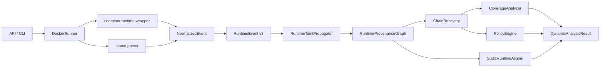

# ProvLoom Dynamic Analysis v3

## Architecture

## RuntimeEvent Schema

`RuntimeEvent` keeps all v2 fields and adds v3 evidence fields:

- `evidence_strength`: exact value, encoded value, explicit file identity, process context, temporal co-occurrence, hash-derived, or unknown.
- `observation_source`: runtime wrapper, strace syscall, inferred relation, instruction simulation, or static alignment.
- `carrier_type` / `carrier_location`: file content/path, argv/env/stdin/stdout, tool argument/return, HTTP header/query/body/form/multipart, upload file, socket payload, LLM/instruction text.
- `derived_from_hash`: marks hash-only observations so policy does not treat them as raw secret exfiltration.
- `instrumentation_visibility`: observed, endpoint-only, payload preview observed, payload not observed, or encrypted payload invisible.
- `raw_event_id`, `trace_file`, `trace_line`, `raw_reference`: raw evidence anchors.

`RuntimeEvent.from_dict()` loads old v2 JSON by filling v3 defaults. `RuntimeEventFactory.create()` now preserves `object_type` before fallback ID generation, so file events get `FILE:/path` rather than `VALUE:/path`.

## DataObject / Carrier Model

The graph still emits legacy File/Process/Tool/Network nodes, but v3 adds carrier-aware `DataObject` nodes:

`SensitiveSource -> DataObject -> Process/Tool/File/NetworkEndpoint`

Carrier-aware edge dedup includes `(source, target, edge_type, carrier_type, carrier_location)`, so header/body/query fields are not merged.

New concrete edge types include `DERIVES`, `READS`, `PROPAGATES`, `SENDS`, and `UPLOADS`. Weak evidence uses `CO_OCCURS` and `HAS_PROCESS_CONTEXT`; these never close confirmed confidentiality chains.

## Evidence Strength

Confirmed confidentiality requires concrete data continuity:

- allowed: `exact_value`, `encoded_value`, `reconstructed_value`, `structured_relation`, `explicit_file_identity`
- rejected for confirmed: `hash_derived`, `process_context`, `temporal_cooccurrence`, `candidate`, `unknown`

Hash-derived observations can still be reviewed, but are not original secret exfiltration.

## Network Evidence Levels

- `endpoint_observed`: connect-only or endpoint metadata.
- `request_observed`: wrapper HTTP structure or plaintext socket payload preview.
- `tainted_payload_observed`: marker/taint is in a specific carrier.
- `tainted_payload_delivered`: reserved for sinks with delivery evidence.
- `encrypted_payload_invisible`: TLS/socket payload is not visible without MITM.

`connect()` alone cannot produce `confidentiality_confirmed`.

## Chain Conditions

Canonical chain types:

- `confidentiality_confirmed`
- `confidentiality_candidate`
- `integrity_confirmed`
- `execution_confirmed`
- `persistence_confirmed`
- `instruction_simulated`
- `insufficient_evidence`

Confirmed confidentiality requires a sensitive source, concrete carrier continuity, a network/upload sink, no weak edge, no instrumentation gap, no instruction simulation-only path, and no hash-only payload.

Candidate chains cover read-before-connect, process context, temporal co-occurrence, legacy weak closure, or missing payload/upload evidence.

Each chain includes `minimal_witness` in metadata with edge type, event ids, raw references, carrier, evidence strength, and transformation.

## Coverage Certificate

Coverage states now distinguish:

- `runtime_confirmed`
- `target_reached_no_flow`
- `path_not_triggered`
- `source_unavailable`
- `sink_unavailable`
- `environment_missing`
- `instrumentation_gap`
- `execution_failed`
- `timeout`
- `unsupported_operation`
- `insufficient_coverage`

Old names are preserved in `metadata.legacy_coverage_state` where applicable.

## Policy Classification

Policy only raises confidentiality violations for `confidentiality_confirmed` chains to non-trusted, non-permitted sinks. It does not upgrade connect-only, process context, instruction simulation, or hash-only flows.

Credential carrier classification:

- `credential_authentication`: Authorization/Cookie header to trusted sink.
- `credential_exposure`: Authorization/Cookie header to untrusted sink.
- `credential_exfiltration`: credential-like taint in non-auth network carrier.

Trusted domains, egress allowlist, permitted source/sink pairs, executable allowlist, persistence targets, protected files, and installation path allowlists remain config-driven.

## Static-Dynamic Alignment

`StaticRuntimeAligner` produces alignment records for runtime file, endpoint, action, and data nodes. With static input it matches exact normalized paths, URL/domain keys, path suffixes, and command/tool basenames. Without static input, DynamicResult reports runtime-only items rather than empty alignment.

Implemented contradiction types include runtime network flow with no static network declaration and runtime endpoint not aligned to a static endpoint key.

## RuntimeInstruction Simulation Limit

`RuntimeInstructionLift` is explicitly marked `instruction_simulation`. It discovers bounded files under the skill root and runs regex simulation only. It does not re-enter a real Agent/tool runtime and cannot close confirmed runtime chains.

## Monitoring Boundaries

Implemented:

- wrapper tool events for read/write/run_command/http_request
- structured HTTP request metadata from wrapper
- strace connect/socket fd/send/write/dup/close tracking
- plaintext socket payload preview where strace exposes bytes
- TLS visibility gap reporting

Not implemented:

- eBPF
- FUSE symbolic reads
- TLS MITM or decrypted HTTPS payload
- byte-level in-process DIFT
- real bounded Agent re-execution for generated instructions

## Difference From SkillDetonate

ProvLoom v3 is more carrier/evidence-sensitive in reports and avoids process-level overtaint for confirmed chains. SkillDetonate has stronger syscall coverage through eBPF/FUSE and symbolic reads. ProvLoom still cannot see encrypted HTTP payload without wrapper-level structure or plaintext trace previews.

## Test List

Unit tests cover marker exfiltration, connect-only candidate, explicit file upload, argv/stdin/pipe marker propagation, process context downgrade, hash-only downgrade, TLS visibility gap, old JSON loading, object id fallback, carrier-aware edge dedup, runtime instruction simulation, static-runtime contradiction, and single canonical analysis reuse.

Docker e2e tests were not added in this round.

## Non-Goals

This version intentionally does not implement eBPF, FUSE, TLS MITM, byte-level DIFT, compression/encryption reversal, or real recursive Agent execution.
