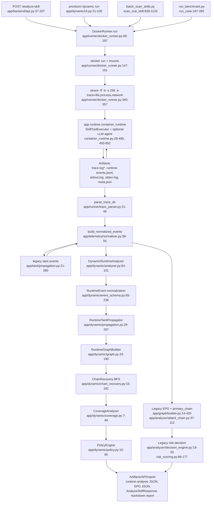

# ProvLoom Dynamic Implementation Audit

Audit date: 2026-07-26  
Scope: `/root/projects/ProvLoom`, implementation code only. README and prior design docs were not used as facts.

## 1. Executive Summary

ProvLoom 当前动态分析是 **Python runtime wrapper + strace 文件/进程/网络 syscall 摘要 + 离线事件级 taint/provenance 分析**。它不是 eBPF/FUSE，也不是字节级或内存级 DIFT。主执行路径由 `DockerRunner.run()` 创建 Docker 容器，运行 `app.runtime.container_runtime`，同时用 `strace -ff -tt -s 256 -e trace=file,process,network` 包裹进程；之后 `analyze_trace()` 和 `build_execution_report()` 会分别重复构建 normalized events 与 dynamic-analysis-v2 结果。关键实现位置：`app/runner/docker_runner.py:48-297`, `app/runtime/container_runtime.py:28-490`, `app/telemetry/normalizer.py:38-55`, `app/dynamic/analyzer.py:64-151`, `app/analyzer/rules.py:65-245`, `app/telemetry/collector.py:98-119`。

最强能力是对声明式/虚拟工具调用的结构化 taint：`read_file -> write_file/run_command/http_request` 的 action 引用和路径引用会生成 `taint_source`, `taint_propagation`, `taint_sink`，并进入 RuntimeProvenanceGraph。实现位置：`app/runtime/container_runtime.py:291-375`, `app/taint/propagation.py:61-280`, `app/dynamic/event_schema.py:165-218`。

最大 soundness 风险是监控边界不等于数据流边界。strace 解析器几乎只消费 `open/openat`, `rename/unlink`, `execve/clone/fork`, `connect`，只特殊解析 DNS `sendmmsg` 中的域名；一般 `send/sendto/write` payload 不被解析为网络正文。因此真实任意程序通过 socket/TLS 发送敏感数据时，动态层通常只能看到 `connect`，不能确认 payload。实现位置：`app/runner/trace_parser.py:49-64`, `app/runner/trace_parser.py:158-182`。

另一个高风险点是存在受元数据开关控制的 process-level conservative overtaint：进程读到 taint 后，若后续文件写事件带 `output_from_tainted_input` 或网络事件带 `opaque_payload`，输出会被保守污染。实现位置：`app/dynamic/propagation.py:97-109`, `app/dynamic/propagation.py:156-169`。真实 strace 路径默认不会产生这些 metadata；测试和 closure lift 会构造。

`connect()` 在 runtime-analysis-v2 中不会闭合 confirmed confidentiality chain。无 payload/upload 证据时，`RuntimeTaintPropagator` 只生成 `candidate_dependency`，`ChainRecovery` 恢复为 `confidentiality_candidate` 且缺 `payload_or_upload_observation`。实现位置：`app/dynamic/propagation.py:194-226`, `app/dynamic/chain_recovery.py:20-23`, `app/dynamic/chain_recovery.py:130-145`。

## 2. Actual Architecture



## 3. Complete Entrypoints And Call Chains

### API main path

`app/main.py:14-22` starts a threaded WSGI server and dispatches to `app.backend.api.application`. `POST /analyze-skill` is implemented in `_handle_analyze_skill()` at `app/backend/api.py:37-207`.

Call chain:

1. `AnalyzeSkillRequest.from_dict()` validates `skill_path`, JSON input, `timeout_seconds` 1..300, `network_policy in {default, disabled}`, and `analysis_mode in {rule_only, rule_plus_epg, static_only}`. Lines: `app/backend/schemas.py:93-129`. Synchronous.
2. Static-only branch calls `resolve_skill_target()`, `load_skill_definition()`, then `analyze_static_skill()`. Lines: `app/backend/api.py:65-87`; static analyzer at `app/analyzer/rules.py:248-421`. This is not a dynamic path.
3. Dynamic branch calls `runner.run(...)`. Lines: `app/backend/api.py:89-96`. Synchronous blocking Docker run.
4. Then calls `analyze_trace(execution, analysis_mode=...)`. Lines: `app/backend/api.py:97`; implementation `app/analyzer/rules.py:65-245`.
5. Then calls `build_execution_report(execution)`. Lines: `app/backend/api.py:98`; implementation `app/telemetry/collector.py:98-119`.
6. API response copies both legacy and v2 fields into `AnalyzeSkillResponse`. Lines: `app/backend/api.py:103-199`; schema fields at `app/backend/schemas.py:141-240`.

Failure handling: JSON and validation errors return 400 (`app/backend/api.py:208-211`); missing Docker returns 503 (`app/backend/api.py:212-213`); `SandboxRunError` returns 400 and writes failed task/log (`app/backend/api.py:214-223`); all other exceptions return 500 (`app/backend/api.py:224-233`).

### Dynamic CLI path

`app/dynamic/cli.py:21-65` defines commands `run`, `trace`, `graph`, `explain`, `validate-config`, `export`.

`run` path:

1. Loads `DynamicAnalysisConfig` and validates it. Lines: `app/dynamic/cli.py:68-73`; config schema `app/dynamic/config.py:41-100`.
2. Parses input JSON or file. Line: `app/dynamic/cli.py:75`.
3. Calls `DockerRunner().run(...)` with `LLMConfig(enabled=False)`. Lines: `app/dynamic/cli.py:76-83`.
4. Calls `analyze_trace()` for legacy review fields. Line: `app/dynamic/cli.py:84`.
5. Calls `build_execution_report()` and then directly runs `DynamicRuntimeAnalyzer(...).analyze_execution()` again. Lines: `app/dynamic/cli.py:85-87`.
6. Persists `runtime-events-v2.jsonl`, `runtime-provenance-graph.json`, `runtime-chains.json`, `dynamic-analysis.json`. Lines: `app/dynamic/analyzer.py:137-151`.

`trace`, `graph`, `explain`, `export` read existing `artifacts/runs/<run_id>/dynamic-analysis.json`; they do not rerun analysis. Lines: `app/dynamic/cli.py:52-64`, `app/dynamic/cli.py:103-119`.

### Batch scan path

`scripts/batch_scan_skills.py` discovers skill roots, preflights supported runtimes/actions, chooses execution profile/adapters/trigger plan, and submits `scan_one_skill()` to a `ThreadPoolExecutor`. Entry arguments: `scripts/batch_scan_skills.py:400-439`; runner construction: `scripts/batch_scan_skills.py:1278-1280`; worker submission: `scripts/batch_scan_skills.py:1535-1564`.

`scan_one_skill()` calls `runner.run()`, `analyze_trace()`, and `build_execution_report()`. Lines: `scripts/batch_scan_skills.py:828-888`. Failures are converted into a failed `SkillScanResult` with static partial report and skip categorization. Lines: `scripts/batch_scan_skills.py:1033-1133`.

### Benchmark path

`scripts/run_benchmark.py:44-92` runs baseline modes. Dynamic cases call `runner.run()`, `analyze_trace()`, and `build_execution_report()` at `scripts/run_benchmark.py:231-285`. Static-only cases call `analyze_static_skill()` at `scripts/run_benchmark.py:198-229`. Non-runnable dynamic cases are skipped for non-static baselines at `scripts/run_benchmark.py:155-156`.

### Telemetry-only path

`app/telemetry/collector.py:98-119` builds normalized events, persists `normalized-events.jsonl`, runs `DynamicRuntimeAnalyzer.analyze_execution()`, persists v2 dynamic artifacts, and returns raw/v2 telemetry. It does not run Docker itself; it consumes a `SandboxExecution`.

## 4. Sandbox And Monitoring Boundary

### Container creation and destruction

`DockerRunner.run()` resolves and parses the skill before Docker starts (`app/runner/docker_runner.py:66-71`), checks Docker and image (`app/runner/docker_runner.py:72-73`, `app/runner/docker_runner.py:298-338`), creates a temporary host skill copy and an artifact dir (`app/runner/docker_runner.py:75-83`), writes `input-payload.json` and `llm-config.json` (`app/runner/docker_runner.py:84-99`), then runs `docker run`.

Container flags:

| Property | Implementation |
|---|---|
| Image | default `skill-runtime-sandbox:latest`, built from `docker/sandbox/Dockerfile`; `app/runner/docker_runner.py:36-45`, `304-338` |
| Capabilities | `--cap-drop ALL`, `--security-opt no-new-privileges`; `app/runner/docker_runner.py:152-155` |
| Limits | `--pids-limit 64`, memory max `memory_limit_mb`, `--cpus 1.0`; `app/runner/docker_runner.py:156-161` |
| Mounts | copied skill dir to `/workspace/skill`, artifact dir to `/artifacts`; `app/runner/docker_runner.py:75-83`, `162-165` |
| Network | default Docker network unless `network_policy == disabled`, then `--network none`; `app/runner/docker_runner.py:169-170` |
| Host alias | `--add-host host.docker.internal:host-gateway`; `app/runner/docker_runner.py:166-167` |
| Cleanup | `docker rm -f <container>` in normal `finally` and hard-timeout path; `app/runner/docker_runner.py:210-214`, `294-296`, `359-365` |

Docker image: Python 3.10 slim with `strace`, `ca-certificates`, `tini`, `time`; copies `app` into `/opt/skill_sandbox/app`; entrypoint is `tini`. Lines: `docker/sandbox/Dockerfile:1-14`.

### Skill and agent execution

For declared skill-actions, `ProvLoomSkillRuntime.execute()` iterates actions sequentially and invokes `SkillToolExecutor.execute_action()`. Lines: `app/runtime/container_runtime.py:435-467`. Supported action types are `read_file`, `write_file`, `run_command`, `http_request`; unknown actions fail inside `execute_action()` with status failed. Lines: `app/runtime/container_runtime.py:60-77`.

For `llm_config.enabled` or runtime in `{deepseek-agent,llm-agent,llm-native}`, `LLMAgentSkillRuntime` is used. Lines: `app/runtime/container_runtime.py:444-452`, `493-578`. It sends real OpenAI-compatible HTTP requests via `OpenAICompatibleClient.chat()` (`app/runtime/llm_client.py:31-75`) and exposes either declared actions or virtual tools (`app/runtime/container_runtime.py:128-213`, `580-622`). Therefore, with LLM enabled, it executes a real remote model call using credentials from `llm-config.json`; without LLM, no real agent reasoning occurs.

### Wrapper and strace

The runner script wraps the runtime command with:

```sh
timeout --preserve-status <N>s sh -lc 'PYTHONPATH=/opt/skill_sandbox /usr/bin/time -v -o /artifacts/runtime-resource-usage.txt strace -ff -tt -s 256 -o /artifacts/trace.log -e trace=file,process,network python -m app.runtime.container_runtime ...'
```

Implementation: `app/runner/docker_runner.py:340-357`.

`-ff` emits one trace file per followed process, so children are trace-file-visible. The parser iterates `trace.log*` (`app/runner/trace_parser.py:21-46`). The parser recognizes only:

| Syscall family | Parsed as | Code |
|---|---|---|
| `open`, `openat`, `openat2` | file read/write/create by flags | `app/runner/trace_parser.py:56-81` |
| `unlink`, `unlinkat`, `rename`, `renameat` | `delete_or_rename` file event | `app/runner/trace_parser.py:58-59` |
| `execve`, `clone`, `clone3`, `vfork`, `fork` | process event | `app/runner/trace_parser.py:60-89` |
| `connect` | network connect | `app/runner/trace_parser.py:62-129` |
| DNS query names in fd-associated send lines after port 53 connect | enriches `original_domain` | `app/runner/trace_parser.py:158-182` |

No eBPF or FUSE implementation exists in `app/`, `docker/`, or tests. The only kernel-level instrumentation is strace. The runner does not mount a FUSE filesystem and does not replace sensitive file contents.

### Credentials and external API

`LLMConfig` defaults include a SiliconFlow base URL and a literal default API key in code (`app/backend/schemas.py:7-10`, `51-59`). `LLMConfig.to_public_dict()` strips the key from API/log response (`app/backend/schemas.py:82-90`). `DockerRunner` writes `llm-config.json` with the key before execution (`app/runner/docker_runner.py:88-99`) and redacts the artifact after Docker exits (`app/runner/docker_runner.py:220`, `367-377`).

Adapters create synthetic files/events under `.provloom/adapters/*`; no real browser/messaging/document system is created. Examples: BrowserAdapter explicitly says no real browser session is created (`app/runtime/adapter_layer.py:122-144`); CredentialStateAdapter writes fake credential files (`app/runtime/adapter_layer.py:232-318`); Webhook/Messaging adapters synthesize endpoint events (`app/runtime/adapter_layer.py:146-229`, `384-481`).

### Timeout and exit handling

Runtime timeout is recorded in `/artifacts/meta.json` by the shell script (`app/runner/docker_runner.py:347-355`). A Python subprocess hard timeout of `timeout_seconds + 60` raises `SandboxRunError` after cleanup (`app/runner/docker_runner.py:201-214`). Non-zero inner exit code is returned as metadata if `meta.json` exists; if Docker fails before artifacts exist, `SandboxRunError` is raised (`app/runner/docker_runner.py:252-257`).

### Behaviors currently not monitored

The implementation does not observe arbitrary socket payloads, TLS plaintext, HTTP multipart structure, file inode identity, file descriptor data continuity, IPC payloads beyond synthetic events, environment variable reads outside wrapper metadata, true stdin/stdout pipes outside wrapper/synthetic events, compression/encryption transformations, hash preimages, memory taint, implicit flows, FUSE symbolic reads, eBPF syscall stream, browser DOM actions, or real external SaaS state. Evidence: trace parser scope `app/runner/trace_parser.py:49-64`; runtime tools `app/runtime/container_runtime.py:215-289`; dynamic propagation rules only inspect `data_preview` and selected metadata keys `app/dynamic/propagation.py:156-173`.

## 5. RuntimeEvent Data Model

`RuntimeEvent` is a dataclass at `app/dynamic/models.py:12-39`.

| Field | Type | Required | Semantics and source |
|---|---:|---:|---|
| `event_id` | `str` | yes | Stable id, generated by `RuntimeEventFactory.next_id()` if absent; `app/dynamic/event_schema.py:25-31` |
| `timestamp` | `float` | yes | Float timestamp; ISO strings are hashed into pseudo-float in `_timestamp_to_float()`, not wall-clock ordered across arbitrary strings; `app/dynamic/event_schema.py:249-256` |
| `event_type` | `str` | yes | Canonical event type such as `file_read`, `network_send`, `taint_source`; conversion in `app/dynamic/event_schema.py:85-236` |
| `process_id` | `int|str|None` | nullable | From normalized metadata `pid/process_id` or explicit factory kwargs; `app/dynamic/event_schema.py:89`, `44` |
| `parent_process_id` | `int|str|None` | nullable | Mostly preserved if supplied; normalized converter rarely sets it; `app/dynamic/models.py:18` |
| `session_id` | `str` | yes | Execution id; set by factory/analyzer; `app/dynamic/event_schema.py:20-22`, `46` |
| `skill_id` | `str` | yes | Usually `Path(execution.skill_path).name`; `app/dynamic/analyzer.py:113-117` |
| `actor_type` | `str` | yes | `process`, `tool`, `agent`; converter in `app/dynamic/event_schema.py:92-218` |
| `actor_id` | `str` | yes | `PROC:<pid>`, `TOOL:<id>`, `AGENT:runtime`; `_actor_id()` at `app/dynamic/event_schema.py:239-246` |
| `object_type` | `str` | yes | `file`, `network`, `process`, `tool`, `value`, `instruction`, etc. |
| `object_id` | `str` | yes | Explicit or synthesized. Note: `RuntimeEventFactory.create()` pops `object_type` before fallback `_object_id(kwargs.get("object_type", ...))`, so fallback object ids may start `VALUE:` even for files; code at `app/dynamic/event_schema.py:48-52` |
| `object_path` | `str|None` | nullable | Normalized path for files/instructions; `_normalize_runtime_path()` at `app/dynamic/event_schema.py:259-265` |
| `operation` | `str` | yes | `read`, `write`, `exec`, `send`, `connect`, `upload`, `derive`, etc.; used by propagation and graph |
| `data_preview` | `str|None` | nullable | Wrapper/test supplied preview; strace file/network events do not include real content; factory hashes/bytes it |
| `data_hash` | `str|None` | nullable | SHA256 of `data_preview` if present; `app/dynamic/event_schema.py:33-37`, `276-277` |
| `byte_count` | `int|None` | nullable | UTF-8 byte length of `data_preview` if not supplied; `app/dynamic/event_schema.py:35-37` |
| `taint_ids` | `list[str]` | optional | Sorted unique ids; `RuntimeEvent.to_dict()` at `app/dynamic/models.py:36-39` |
| `evidence_level` | `str` | optional | `confirmed`, `conservative`, `candidate`, `unknown`; no runtime validation beyond defaults |
| `raw_source` | `str` | optional | `runtime`, `strace`, `taint`, `closure_lift`, `adapter`, `trigger`, etc. |
| `raw_reference` | `str` | optional | Normalized event id or parent event id reference; converter passes `normalized.event_id` |
| `metadata` | `dict[str,Any]` | optional | Free-form payload, normalized paths for selected keys; `app/dynamic/event_schema.py:31-62`, `268-273` |

Information presence:

| Requested info | Current support |
|---|---|
| actor/object/operation | First-class fields |
| source/sink | Source and sink are not first-class fields on RuntimeEvent; represented by `object_*`, `metadata.source`, `metadata.target`, `metadata.destination`, or graph nodes |
| taint | `taint_ids`, `metadata.marker_matches`, `metadata.taint_reasons` |
| payload | Only `data_preview` or metadata keys `body`, `headers`, `query`, `socket_payload`, `tool_arguments`; strace does not decode HTTP body |
| endpoint | Network object id and metadata `url/domain/host/port/sink_*`; normalized at `app/telemetry/normalizer.py:205-247`, endpoint enrichment at `353-491` |
| process id | `process_id`; parent process rarely populated |
| file inode/path | Path yes; inode no dynamic producer. `FileTaintRecord` has inode field but not populated here (`app/taint/state.py:10-27`) |
| timestamp | yes, float after conversion |
| evidence/raw_reference | yes |
| confidence | RuntimeEvent has no confidence field; edges compute confidence from evidence at `app/dynamic/models.py:181-182` |
| modality | No first-class field |

### Real RuntimeEvent examples

Generated through the current code path `RuntimeEventFactory -> analyze_runtime_events -> RuntimeTaintPropagator`, not hand-written.

Sensitive file read:

```json
{
  "event_id": "EV000001",
  "timestamp": 1.0,
  "event_type": "file_read",
  "process_id": 10,
  "parent_process_id": null,
  "session_id": "RUN-AUDIT",
  "skill_id": "audit-skill",
  "actor_type": "process",
  "actor_id": "PROC:10",
  "object_type": "file",
  "object_id": "VALUE:/secret/api_key",
  "object_path": "/secret/api_key",
  "operation": "read",
  "data_preview": "PROVLOOM_SECRET_T001_D02A1A63E7CB59F6",
  "data_hash": "0f16b7c611b1f4414d3796f770308612092bd56a82378b657c8dd771dcfb5425",
  "byte_count": 37,
  "taint_ids": ["T001"],
  "evidence_level": "confirmed",
  "raw_source": "runtime_wrapper",
  "raw_reference": "",
  "metadata": {
    "marker_matches": [{"taint_id": "T001", "variant": "split_concat", "derived": false}],
    "taint_reasons": ["marker_variant:split_concat", "sensitive_source_path", "read_tainted_file"]
  }
}
```

Intermediate file propagation:

```json
{
  "event_id": "EV000002",
  "timestamp": 2.0,
  "event_type": "file_write",
  "process_id": 10,
  "parent_process_id": null,
  "session_id": "RUN-AUDIT",
  "skill_id": "audit-skill",
  "actor_type": "process",
  "actor_id": "PROC:10",
  "object_type": "file",
  "object_id": "VALUE:runtime_output/relay.txt",
  "object_path": "runtime_output/relay.txt",
  "operation": "write",
  "data_preview": "PROVLOOM_SECRET_T001_D02A1A63E7CB59F6",
  "data_hash": "0f16b7c611b1f4414d3796f770308612092bd56a82378b657c8dd771dcfb5425",
  "byte_count": 37,
  "taint_ids": ["T001"],
  "evidence_level": "confirmed",
  "raw_source": "runtime_wrapper",
  "raw_reference": "",
  "metadata": {
    "marker_matches": [{"taint_id": "T001", "variant": "split_concat", "derived": false}],
    "taint_reasons": ["marker_variant:split_concat"]
  }
}
```

File upload/network sink:

```json
{
  "event_id": "EV000003",
  "timestamp": 3.0,
  "event_type": "file_upload",
  "process_id": 11,
  "parent_process_id": null,
  "session_id": "RUN-AUDIT",
  "skill_id": "audit-skill",
  "actor_type": "process",
  "actor_id": "PROC:11",
  "object_type": "network",
  "object_id": "NET:https://evil.test/upload",
  "object_path": null,
  "operation": "upload",
  "data_preview": null,
  "data_hash": null,
  "byte_count": null,
  "taint_ids": ["T001"],
  "evidence_level": "confirmed",
  "raw_source": "runtime_wrapper",
  "raw_reference": "",
  "metadata": {
    "url": "https://evil.test/upload",
    "upload_file_path": "runtime_output/relay.txt",
    "taint_reasons": ["explicit_tainted_file_upload"]
  }
}
```

## 6. Taint Sources And Marker Generation

There are two taint-source mechanisms.

### Runtime wrapper legacy taint labels

`SourceRegistry.match_path()` classifies paths. Defaults are `/etc/passwd`, `/etc/shadow`, `/etc/hosts`, `/root/**`, `/proc/**`, `/sys/**`, `/var/run/**`, and credential-state adapter paths. Lines: `app/taint/source_registry.py:10-21`, `56-77`.

Source types emitted by this registry:

| source_type | Trigger |
|---|---|
| `synthetic_credential` | Path contains `credential_state/` or basename in `fake.env`, `fake_token.json`, `fake_account_profile.json`, `fake_scopes.txt`; `app/taint/source_registry.py:61-68` |
| `sensitive_file` | Default/env source path glob match; `app/taint/source_registry.py:70-76` |

`TaintLabel.create()` generates deterministic `T-<sha256-prefix>` ids from run id, source type, source object, and source event id. Lines: `app/taint/models.py:18-59`. It does not generate a content marker and does not modify files.

### Dynamic marker registry

`TaintRegistry.register_source()` creates `T001`, `T002`, ... and marker `PROVLOOM_SECRET_<taint_id>_<entropy>`. Lines: `app/dynamic/marker_registry.py:34-67`, `91-97`. Entropy is `secrets.token_hex(bytes_of_entropy)` unless a seed is passed for deterministic tests. Defaults: prefix `PROVLOOM_SECRET`, 8 bytes entropy, hash derivatives enabled (`app/dynamic/config.py:25-30`).

Dynamic marker source types are not enumerated centrally. Actual implementation uses:

| source_type | Code path |
|---|---|
| caller-supplied arbitrary string | `register_source(source_type=...)`; `app/dynamic/marker_registry.py:34-42` |
| `secret_file` | `ensure_source_for_path()` default and sensitive path read rule; `app/dynamic/marker_registry.py:69-74`, `app/dynamic/propagation.py:83-88` |
| `credential` | Test fixture only; `test/test_dynamic_runtime_analysis_v2.py:14-18` |

Variants detected: raw, Base64, hex, URL encoded, JSON escaped, split-concat, optional SHA256. Lines: `app/dynamic/marker_registry.py:100-113`. SHA256 variants are marked `derived=True` and evidence `conservative`; raw and reversible encodings are `confirmed` (`app/dynamic/marker_registry.py:57-66`). Collision risk is low for seeded/secret entropy but not cryptographically impossible; no explicit collision handling exists beyond `_variant_to_taint` last-write-wins (`app/dynamic/marker_registry.py:31-32`, `57-66`).

Current code does not inject markers into real `/etc` or `/root` files, environment variables, or tool return values. Markers are created in audit-side registry and matched when event previews/metadata contain them. Wrapper taint uses labels without marker substitution.

## 7. Taint Propagation Rules

### Runtime wrapper / legacy taint analyzer

Implemented in `app/taint/propagation.py:37-505` and invoked by normalized event construction (`app/telemetry/normalizer.py:290-315`).

| Rule | Status | Evidence |
|---|---|---|
| sensitive file read -> tool output | Implemented for `read_file`; path match creates `taint_source` and propagation to tool output; `app/taint/propagation.py:112-138` |
| action stdout reference -> downstream tool input | Implemented via `actions.<id>.stdout` regex; `app/taint/propagation.py:15`, `449-463`, `473-478` |
| tool input -> file write | Implemented for `write_file`, including append; `app/taint/propagation.py:139-164` |
| run_command path refs -> command stdout | Conservative; scans command text for paths; `app/taint/propagation.py:195-224` |
| shell redirect -> file | Conservative for `>` only; `app/taint/propagation.py:226-236`, `490-492` |
| http_request body/query sink | Implemented; body/url action refs drive sink taint; `app/taint/propagation.py:166-193`, `app/taint/sink_tracker.py:11-34` |
| curl/wget command body sink | Conservative heuristic; `app/taint/propagation.py:238-249`, `500-502` |
| read then connect without payload | Candidate only; `app/taint/propagation.py:251-280` |
| env vars/stdin/stdout/pipe/subprocess | Not generally implemented in legacy analyzer except command string/path heuristics |
| encoding/split/hash/compress/encrypt | Not implemented in legacy analyzer |

### Runtime-analysis-v2 propagator

Implemented in `app/dynamic/propagation.py:29-257`.

| Category requested | Status | Implementation |
|---|---|---|
| tool input -> tool output | Partially implemented: tool event declared `input_taint_ids` are merged; return events populate `tool_outputs`, but `tool_outputs` is not consumed elsewhere; `app/dynamic/propagation.py:146-155` |
| file read -> process/tool | Implemented: sensitive path creates/uses source; tainted file read taints process_inputs; `app/dynamic/propagation.py:83-95` |
| process/tool -> file write | Implemented if event already tainted; conservative if process has taint and event metadata has `output_from_tainted_input`; otherwise clears file taint; `app/dynamic/propagation.py:97-109` |
| argv | Implemented by marker detection in `metadata.argv`; `app/dynamic/propagation.py:120-130` |
| environment variables | Partially implemented only if event metadata has `env` containing marker; no real env-read monitor; `app/dynamic/propagation.py:120-123` |
| stdin | Partially implemented if metadata/operation contains marker; `app/dynamic/propagation.py:72-74`, `120-123`, `132-145` |
| stdout/stderr | Partially implemented as IPC event operations; no strace stdout payload parser; `app/dynamic/propagation.py:72-74`, `132-145` |
| pipe | Partially implemented for synthetic `pipe` RuntimeEvent; `app/dynamic/propagation.py:132-141` |
| shell command | Partially implemented by marker/path metadata in process_exec and legacy `run_command` heuristics; `app/dynamic/propagation.py:120-130`, `app/taint/propagation.py:195-249` |
| subprocess | Partially implemented through `process_exec` marker metadata; no parent-child taint inheritance rule by fork alone; `app/dynamic/propagation.py:120-130` |
| temporary file | Implemented as normal file path taint if file write/read/upload events preserve path; `app/dynamic/propagation.py:97-118`, `156-160` |
| network header/query/body | Implemented only if metadata keys `headers`, `query`, `body` contain marker; `app/dynamic/propagation.py:161-164` |
| multipart upload/file upload | File upload implemented through `upload_file_path`; multipart fields not parsed; `app/dynamic/propagation.py:156-160` |
| LLM context | Wrapper emits LLM request/response events, but v2 converter ignores `llm_step`; no v2 taint propagation through LLM messages; `app/dynamic/event_schema.py:85-236` lacks `llm_step` branch |
| runtime-generated instruction | Implemented by closure lift adapter with regex for `read <path>` and `POST <url>`; `app/dynamic/closure_lift.py:24-62`, `82-121` |
| Base64/hex/URL/JSON escaped/split | Implemented marker variants; `app/dynamic/marker_registry.py:100-110` |
| hash | Partially implemented as SHA256 marker-derived conservative evidence; cannot prove original preimage exfiltration; `app/dynamic/marker_registry.py:111-113`, `57-66` |
| compression/encryption | Not implemented |
| split across separate events/chunks | Not implemented; `split_concat` is identical concatenation in one string, not chunk tracking; `app/dynamic/marker_registry.py:102-110` |

Process-level overtaint exists but is gated:

1. A file read with taint stores `self.process_inputs[PROC:<pid>]`. Lines: `app/dynamic/propagation.py:92-95`.
2. Later file write by same process is tainted only if metadata `output_from_tainted_input` is truthy. Lines: `app/dynamic/propagation.py:101-108`.
3. Later network send/upload is tainted only if no direct taint exists, same process has taint, and metadata `opaque_payload` is truthy. Lines: `app/dynamic/propagation.py:165-169`.

This can cause false positives for opaque transformations where the process merely read a secret but did not include it in the output. It is not unconditional "all subsequent outputs are tainted"; metadata must opt in.

## 8. Network Sink Determination

Network telemetry has two sources:

1. strace `connect()` events parsed to host/port and optionally enriched with DNS name. `app/runner/trace_parser.py:92-129`, `158-182`.
2. wrapper/taint synthetic events from `http_request`, command heuristic, adapters, triggers. `app/runtime/container_runtime.py:271-289`, `app/taint/propagation.py:166-193`, `app/runtime/adapter_layer.py:184-229`, `415-481`, `app/runner/docker_runner.py:527-597`.

Distinctions:

| Behavior | Current status |
|---|---|
| socket creation | Not parsed as event |
| DNS lookup | Partially inferred when trace has port 53 connect and fd-associated DNS payload; `app/runner/trace_parser.py:158-182` |
| connect() | Parsed and normalized as `network_connect`; `app/dynamic/event_schema.py:109-124` |
| HTTP method/domain/path | Available for wrapper `http_request` config and endpoint resolver; strace alone sees IP/port unless DNS/tool/command hints enrich it |
| request header/body/query | Only wrapper config/metadata; no TLS/plain socket body parser |
| file upload | v2 supports `file_upload` event with `upload_file_path`; runtime wrapper does not expose a dedicated upload action |
| actual tainted bytes sent | Confirmed only if marker appears in metadata/body/header/query/socket_payload/tool_arguments or explicit tainted file upload exists; `app/dynamic/propagation.py:156-164` |
| TLS plaintext | Not visible through strace parser |
| trusted endpoints | v2 PolicyEngine uses `trusted_domains` and `trusted_egress_allowlist`; `app/dynamic/policy.py:57-62`, config defaults `app/dynamic/config.py:52-53` |
| auth vs exfil | Dynamic v2 does not special-case Authorization headers; static dataflow has auth handling, but runtime v2 treats marker in `headers` as tainted network send |

`connect()` alone cannot close a confirmed v2 confidentiality chain. It can create `confidentiality_candidate` through candidate dependency. Code: `app/dynamic/propagation.py:194-226`, `app/dynamic/chain_recovery.py:20-21`, `app/dynamic/chain_recovery.py:130-145`.

Current confirmed source-to-external sink conditions:

1. `RuntimeEvent` of `network_send`/`file_upload` or operation `send`/`upload` carries taint ids after marker or structured propagation; graph edge type `SEND` or `UPLOAD_FILE`; chain type `confidentiality`; `PolicyEngine` checks sink not trusted. Code: `app/dynamic/propagation.py:156-169`, `app/dynamic/graph.py:82-96`, `app/dynamic/chain_recovery.py:20`, `app/dynamic/policy.py:14-28`.
2. Legacy decision path requires a `taint_sink` event with evidence `confirmed`/`conservative` and taint ids for `read_then_exfiltration`. Code: `app/analyzer/rules.py:652-673`, `app/analyzer/risk_scoring.py:28-47`.

## 9. RuntimeProvenanceGraph Schema And Behavior

Schema classes: `RuntimeNode`, `RuntimeEdge`, `RuntimeProvenanceGraph` at `app/dynamic/models.py:57-124`.

Node types emitted by `RuntimeGraphBuilder`:

| Node type | Node id rule | Code |
|---|---|---|
| `SensitiveSource` | `source:<taint_id>` | `app/dynamic/graph.py:39-46`, `64-68`, `77-80` |
| `Process` | actor id or process object id | `app/dynamic/graph.py:140-150` |
| `AgentSession` | actor id for `agent` | `app/dynamic/graph.py:140-142` |
| `ToolInvocation` | `TOOL:<id>` | `app/dynamic/graph.py:132-134`, `140-142` |
| `File` | `file:<path>` | `app/dynamic/graph.py:145-146` |
| `NetworkEndpoint` | `network:<object_id>` | `app/dynamic/graph.py:147-148` |
| `RuntimeInstruction` | `instruction:<path-or-id>` | `app/dynamic/graph.py:151-152` |
| `PersistenceTarget` | `persistence:<object_id>` | `app/dynamic/graph.py:153-154` |
| `DataObject` | object id | `app/dynamic/graph.py:155` |

Edge types are mapped from operations by `EDGE_BY_OPERATION` at `app/dynamic/graph.py:9-30`, plus special cases in `_ingest()`: `DERIVE`, `READ`, `WRITE`, `EXEC`, `PASS_AS_ARGUMENT`, `PIPE`, `MATERIALIZE_INSTRUCTION`, `SEND`, `CONNECT`, `UPLOAD_FILE`.

Deduplication: nodes are keyed by node id and metadata merged (`app/dynamic/graph.py:157-162`); edges are keyed by `(source,target,type)`, event ids/taint ids are merged (`app/dynamic/graph.py:164-185`). Edge evidence stores `event_ids`, `taint_ids`, `evidence_level`, confidence from evidence level, reason, and full event copies in `metadata.events`.

Time ordering is retained inside event timestamps and event lists but graph edges themselves are not topologically time-constrained during BFS. Data object continuity is path/id based; inode and fd continuity are not modeled.

The graph can contain inferred/weak edges:

| Edge | Why weak |
|---|---|
| `candidate_dependency` source->network connect | Created from read-before-connect without payload evidence; `app/dynamic/propagation.py:194-226`, graph at `app/dynamic/graph.py:70-75` |
| `opaque_payload` source->actor | Conservative process-level metadata; `app/dynamic/graph.py:87-90` |
| closure lift `MATERIALIZE_INSTRUCTION` and regex-derived read/send | Derived from generated file text, not re-executed by full agent; `app/dynamic/closure_lift.py:76-121` |

No graph size cap, pruning, or max node/edge limit exists in `RuntimeGraphBuilder`; only closure lift has file count/size/depth limits.

Small confirmed graph observed from current code:

```text
source:T001
  --DERIVE EV000001--> file:/secret/api_key
  --READ EV000001--> PROC:10
  --WRITE EV000002--> file:runtime_output/relay.txt
  --UPLOAD_FILE EV000003--> network:NET:https://evil.test/upload
```

Recovered chain from code:

```json
{
  "chain_type": "confidentiality",
  "source": "source:T001",
  "sink": "network:NET:https://evil.test/upload",
  "ordered_nodes": ["source:T001", "file:/secret/api_key", "PROC:10", "file:runtime_output/relay.txt", "network:NET:https://evil.test/upload"],
  "supporting_event_ids": ["EV000001", "EV000002", "EV000003"],
  "evidence_level": "confirmed",
  "coverage_status": "triggered_and_observed"
}
```

Evidence code: source/read edges `app/dynamic/graph.py:98-103`; write edge `app/dynamic/graph.py:105-107`; upload edge `app/dynamic/graph.py:92-96`.

## 10. Risk Chain Recovery

`ChainRecovery.recover()` builds four categories: `confidentiality`, `confidentiality_candidate`, `execution`, `persistence`. Lines: `app/dynamic/chain_recovery.py:15-24`.

Algorithm:

| Property | Implementation |
|---|---|
| source selection | all nodes with `node_type == SensitiveSource`; `app/dynamic/chain_recovery.py:37` |
| sink selection | terminal edges to target node types: `SEND/UPLOAD_FILE -> NetworkEndpoint`, `CONNECT -> NetworkEndpoint`, `EXEC`, `PERSIST/MATERIALIZE_INSTRUCTION`; `app/dynamic/chain_recovery.py:20-23`, `38-42` |
| search | BFS over directed adjacency; `app/dynamic/chain_recovery.py:78-106` |
| max depth | 8 edges; `app/dynamic/chain_recovery.py:94-95` |
| taint filter | if terminal edge has taints, intermediate tainted edges with disjoint taints are skipped; untainted edges are still allowed; `app/dynamic/chain_recovery.py:100-101` |
| cycles | visited key is `(target_node, depth)`, so same node can be revisited at different depths; `app/dynamic/chain_recovery.py:88-103` |
| multiple source/sink | all source-terminal pairs, then dedup by ordered edge list; `app/dynamic/chain_recovery.py:43-56`, `172-181` |
| ranking | prefers paths with READ, then relay edge, then shorter path; `app/dynamic/chain_recovery.py:109-113` |
| status | missing observation added if any `CONNECT` edge appears in chain; coverage becomes partial; `app/dynamic/chain_recovery.py:130-145` |

Confirmed chain example: the `source:T001 -> file:/secret/api_key -> PROC:10 -> file:runtime_output/relay.txt -> network:NET:https://evil.test/upload` chain above. It is confirmed because all edge evidence is confirmed and terminal is `UPLOAD_FILE`.

Candidate/partial chain example from current code:

```json
{
  "chain_type": "confidentiality_candidate",
  "source": "source:T001",
  "sink": "network:NET:https://example.test/ping",
  "ordered_nodes": ["source:T001", "file:/secret/api_key", "PROC:20", "network:NET:https://example.test/ping"],
  "evidence_level": "unknown",
  "missing_observation_points": ["payload_or_upload_observation"],
  "coverage_status": "triggered_but_partially_observed"
}
```

Rejected/no-chain example: a single `network_connect` with no source creates no chain; `CoverageAnalyzer` returns `triggered_and_observed` with reason "runtime emitted events but no supported sensitive flow chain closed". This follows `app/dynamic/coverage.py:36-39`.

False closure risk: v2 avoids confirmed closure for `connect` alone, but weak/co-occurrence chains still exist as `confidentiality_candidate`. In the legacy EPG path, `candidate_dependency` edges are excluded from BFS adjacency (`app/analyzer/attack_chain.py:115-123`), but other `causes`, `taint_propagates`, `sent_to`, `exfiltrated_to` edges are bidirectional, which can recover analyst chains not strictly preserving data direction (`app/analyzer/attack_chain.py:121-122`).

## 11. CoverageAnalyzer

Coverage states are enumerated at `app/dynamic/config.py:9-22`. `CoverageAnalyzer.analyze()` implements only event/chain/exit based classification (`app/dynamic/coverage.py:7-49`).

| Requested coverage property | Status |
|---|---|
| skill activated | Indirect via non-empty runtime events; no dedicated field |
| source exists | In `taint_sources`, not coverage model |
| source read | Indirect via chain/events; no explicit expected source matrix |
| target action executed | Tool events exist, but coverage does not compare against static target actions |
| branch reached | Not implemented |
| sink available | Not implemented, except explicit event can set `endpoint_unavailable` |
| network available | Not implemented except `network_policy` outside coverage and explicit events |
| external API available | Not implemented except explicit state |
| user confirmation | Only if explicit event has coverage_state `user_confirmation_missing`; `app/dynamic/coverage.py:42-48` |
| instrumentation complete | Not implemented |
| timeout | Implemented; `app/dynamic/coverage.py:9-10` |
| crash/dependency failure | Non-zero exit -> `execution_failed`; no dependency taxonomy; `app/dynamic/coverage.py:13-14` |
| unsupported operation/environment | Only if explicit event says so |

Distinctions it can make:

| Case | How |
|---|---|
| no events | `not_triggered`; `app/dynamic/coverage.py:36-37` |
| timeout | `timeout`; `app/dynamic/coverage.py:9-10` |
| non-zero exit | `execution_failed`; `app/dynamic/coverage.py:13-14` |
| explicit missing state | first event metadata `coverage_state` or event type in `COVERAGE_STATES`; `app/dynamic/coverage.py:16-18`, `42-49` |
| candidate read/connect | `triggered_but_partially_observed`; `app/dynamic/coverage.py:25-31` |
| no supported flow but events exist | `triggered_and_observed`; `app/dynamic/coverage.py:39` |

It cannot reliably distinguish "path not triggered", "monitoring blind spot", "environment missing", and "true no-flow" unless an upstream explicit coverage event is injected.

## 12. Policy Conditions

There are two policy/decision systems.

### Runtime-analysis-v2 PolicyEngine

Implemented rules in `app/dynamic/policy.py:10-65`:

| Rule | Evidence required |
|---|---|
| confidentiality violation | A `RuntimeChain` with `chain_type == confidentiality`, nontrusted sink, any evidence level; `app/dynamic/policy.py:16-28` |
| persistence/instruction integrity violation | Any `chain_type == persistence`; `app/dynamic/policy.py:29-40` |
| executable allowlist violation | Any event with `operation == exec`, `object_path` present, and path not matching `executable_allowlist`; `app/dynamic/policy.py:41-55` |

Trusted sinks use URL hostname or `network:NET:` stripped label against `trusted_domains` and `trusted_egress_allowlist`. Lines: `app/dynamic/policy.py:57-62`; defaults: `localhost`, `127.0.0.1` at `app/dynamic/config.py:52-53`.

Rules configured but not enforced by `PolicyEngine`: `allowed_tool_destinations`, `permitted_source_to_sink_pairs`, `writable_directory_allowlist`, `trusted_download_domains`, `persistence_targets`, `protected_files`, `permitted_installation_paths`. They appear in `DynamicAnalysisConfig` at `app/dynamic/config.py:54-61`.

Specific checks:

| Question | Current answer |
|---|---|
| read sensitive file + connect -> exfiltration? | v2: no confirmed confidentiality violation; candidate only. Legacy final decision may still become malicious if a conservative/confirmed taint_sink exists, not mere connect. |
| download file + execute same artifact identity? | Weak. `ChainRecovery._recover_execution()` looks for edges with `metadata.remote_artifact` then BFS to EXEC, but no current dynamic producer sets robust artifact identity/inode; `app/dynamic/chain_recovery.py:58-75` |
| process read source then ordinary network | v2 avoids confirmed unless `opaque_payload`; candidate_dependency can appear. |
| hash-derived flow | Marker SHA256 is conservative, not confirmed, but `PolicyEngine` does not downgrade by derived flag once a confidentiality chain exists; marker match records derived in metadata. |
| auth header as credential exfil | v2 treats marker in `headers` as network taint. There is no dynamic auth-vs-exfil classifier. Static dataflow has auth-specific logic, outside runtime v2. |

### Legacy final decision/risk scoring

`analyze_trace()` uses `evaluate_decision()` and `score_risk_factors()` after v2 and EPG. Lines: `app/analyzer/rules.py:167-245`, `app/analyzer/decision_engine.py:19-93`, `app/analyzer/risk_scoring.py:86-177`.

Rules:

| Risk factor | Condition |
|---|---|
| `high_sensitivity_source_to_external_sink` | high source + evidence-backed external sink + confirmed/conservative taint_sink; `app/analyzer/risk_scoring.py:28-47`, `90-104` |
| `generated_artifact_external_transfer` | medium generated non-public source + evidence-backed external upload/callback/unknown; `app/analyzer/risk_scoring.py:50-61`, `105-113` |
| `overprivileged_outward_tool_action` | computed in `evaluate_decision()` from generated source + external http-like sink; `app/analyzer/decision_engine.py:41-55`, risk factor at `app/analyzer/risk_scoring.py:114-122` |
| `unsafe_command_construction` | templated input, shell composition, or sensitive path in command; `app/analyzer/decision_engine.py:96-127`, factor `app/analyzer/risk_scoring.py:123-131` |
| `llm_directed_external_account_registration` | LLM involved + external public upload/post sink label contains registration/credential tokens; `app/analyzer/risk_scoring.py:64-83`, `132-143` |
| `llm_induced_risky_action` | LLM + outward network or risky command; `app/analyzer/risk_scoring.py:144-152` |
| `unknown_source_external_sink` | unknown source + outward network + callback/LLM-mediated/unknown sink; `app/analyzer/risk_scoring.py:153-169` |

## 13. RuntimeInstructionLift

`RuntimeInstructionLift.discover()` scans already observed events for operations `write` or `materialize_instruction` whose `object_path` suffix is one of `.md`, `.txt`, `.yaml`, `.yml`, `.json`. Lines: `app/dynamic/closure_lift.py:24-31`; config defaults at `app/dynamic/config.py:32-39`.

Boundary and limits:

| Property | Current behavior |
|---|---|
| confined to skill root | `_resolve()` requires resolved path under `skill_root`; `app/dynamic/closure_lift.py:64-73` |
| file existence and size | must exist and size <= 64 KiB by default; `app/dynamic/closure_lift.py:35-37` |
| duplicate prevention | SHA256 of file bytes in `_processed_hashes`; `app/dynamic/closure_lift.py:38-42` |
| max files | default 4 per session; `app/dynamic/config.py:35-37`, `app/dynamic/closure_lift.py:25`, `60-61` |
| depth | default max_depth 1, but `discover()` is not recursively called on newly lifted events inside analyzer; `app/dynamic/analyzer.py:95-97` |
| re-execution by real agent | Not implemented. `RuntimeInstructionAdapter.execute()` regex-parses file text and emits synthetic `file_read` and `network_send` events; `app/dynamic/closure_lift.py:76-121` |
| parsing | `read <path>` and `POST <url>` regex only; `app/dynamic/closure_lift.py:13-15`, `85-121` |
| graph distinction | generated instruction node type `RuntimeInstruction`, operation `materialize_instruction`; `app/dynamic/graph.py:121-123`, `151-152` |

The adapter can generate conservative exfil chain because regex `read /secret` taints the same process, and regex `POST` emits a `network_send` with `opaque_payload=True` (`app/dynamic/closure_lift.py:103-119`), which v2 propagator treats as `opaque_process_payload_after_tainted_input` (`app/dynamic/propagation.py:165-169`).

## 14. Static-Dynamic Alignment

Current status: **not implemented beyond passive keys and coexistence summary**.

Evidence:

| Alignment item | Status |
|---|---|
| static entity -> runtime key | Static entities get `runtime_alignment_keys`; `app/static/entity_schema.py:32-43`, resolver keys `app/static/entity_resolver.py:137-149` |
| static action -> runtime operation | No matcher found; instruction orchestrator returns empty `aligned_operations`; `app/instruction/orchestrator.py:106-109` |
| static artifact -> runtime inode/path | No runtime inode; path keys only; `app/taint/state.py:10-27` has inode field but no population |
| static endpoint -> runtime endpoint | No aligner found; endpoint keys exist only as static metadata |
| instruction edge -> runtime edge | Not implemented |
| contradiction detection | Not implemented |
| missing-edge explanation | Not implemented except coverage lacks generic explanation; static path validator can say runtime confirmation required, but not compare runtime graph |

## 15. API, CLI, Output, Reports

Dynamic-related API:

| Endpoint | Implementation |
|---|---|
| `GET /health` | `app/backend/api.py:27-28` |
| `POST /analyze-skill` | dynamic/static analysis; `app/backend/api.py:29-30`, `37-207` |
| `GET /task/<id>` | task lookup; `app/backend/api.py:31-32`, `236-250` |

Dynamic CLI:

| Command | Implementation |
|---|---|
| `run` | execute Docker + v2 analysis; `app/dynamic/cli.py:25-32`, `68-100` |
| `trace` | print `runtime_events`; `app/dynamic/cli.py:33-35`, `52-53` |
| `graph` | print RPG summary; `app/dynamic/cli.py:36-37`, `54-55` |
| `explain` | print chains; `app/dynamic/cli.py:39-40`, `56-57` |
| `validate-config` | validate dynamic config; `app/dynamic/cli.py:42-43`, `58-62` |
| `export` | JSON or minimal markdown; `app/dynamic/cli.py:45-47`, `110-119` |

Output files:

| File | Writer |
|---|---|
| `runtime-events.jsonl` | container runtime wrapper; `app/runtime/container_runtime.py:469-490` |
| `trace.log*` | strace runner script; `app/runner/docker_runner.py:347` |
| `stdout.log`, `stderr.log`, `meta.json` | runner script; `app/runner/docker_runner.py:347-355` |
| `normalized-events.jsonl` | `persist_normalized_events()`; `app/telemetry/normalizer.py:58-63` |
| `runtime-events-v2.jsonl` | `persist_dynamic_analysis()`; `app/dynamic/analyzer.py:141-148` |
| `runtime-provenance-graph.json` | `persist_dynamic_analysis()`; `app/dynamic/analyzer.py:142`, `149` |
| `runtime-chains.json` | `persist_dynamic_analysis()`; `app/dynamic/analyzer.py:143`, `150` |
| `dynamic-analysis.json` | `persist_dynamic_analysis()`; `app/dynamic/analyzer.py:144`, `151` |
| `epg.json`, `attack-chain.json` | legacy EPG path; `app/analyzer/rules.py:692-706` |
| per-skill markdown | `generate_report_file()`; `app/reporting/skill_report.py:35-65`, batch call `scripts/batch_scan_skills.py:1264-1276`, `1562-1564` |

Final report fields:

| Field requested | Present? |
|---|---|
| minimal witness path | v2 `runtime_chains`; legacy `primary_chain` |
| full graph | v2 `runtime_provenance_graph`, legacy `epg.json` |
| raw trace reference | v2 `raw_reference`; graph edge metadata contains event dicts; not direct trace line for all events |
| source/sink | chains and graph nodes |
| edge evidence | v2 edge `event_ids`, `metadata.events`; `app/dynamic/models.py:68-85`, `app/dynamic/graph.py:164-185` |
| taint transformation | limited to `taint_reasons`, `propagation_rule`, marker variant |
| coverage state | v2 `coverage` |
| uncertainty | evidence levels and missing observations |
| replay information | partial: command, artifacts dir, input payload; no deterministic replay manifest |
| policy reason | v2 `policy_violations.reason`; legacy `triggered_factors.rationale` |
| HTML/graphics | No runtime HTML report generator found; markdown and JSON only |

## 16. Test Results

Commands run:

```sh
python -m pytest test/test_dynamic_runtime_analysis_v2.py test/test_dynamic_decision_regression.py test/test_trace_parser_network_resolution.py test/test_adapter_layer.py test/test_trigger_synthesis.py -q
```

Result: failed to start because `/bin/bash: python: command not found`.

```sh
python3 -m pytest test/test_dynamic_runtime_analysis_v2.py test/test_dynamic_decision_regression.py test/test_trace_parser_network_resolution.py test/test_adapter_layer.py test/test_trigger_synthesis.py -q
```

Result: failed to start because `/usr/bin/python3: No module named pytest`.

```sh
skillscan/.venv/bin/python -m pytest test/test_dynamic_runtime_analysis_v2.py test/test_dynamic_decision_regression.py test/test_trace_parser_network_resolution.py test/test_adapter_layer.py test/test_trigger_synthesis.py -q
```

Result: failed to start because venv also lacks pytest.

```sh
python3 -m unittest discover -s test -p 'test_dynamic*.py' &&
python3 -m unittest discover -s test -p 'test_trace_parser_network_resolution.py' &&
python3 -m unittest discover -s test -p 'test_adapter_layer.py' &&
python3 -m unittest discover -s test -p 'test_trigger_synthesis.py'
```

Result: 41 tests passed, 0 failed, 0 skipped. Breakdown: dynamic tests 30 passed, trace parser 1 passed, adapter layer 5 passed, trigger synthesis 5 passed. No Docker, root, network, or model API was required; these are unit/synthetic tests.

Coverage by capability:

| Capability | Test coverage |
|---|---|
| marker registration/variants | Covered in `test_dynamic_runtime_analysis_v2.py:14-18`, base64 test `86-96` |
| file propagation | Covered direct/file relay tests `27-62`, opaque file `98-110` |
| process propagation | Covered argv/stdin/pipe synthetic tests `63-85` |
| pipe | Covered synthetic `pipe` RuntimeEvent only; `74-85` |
| network payload | Covered only via metadata `body`, not real socket capture; `27-36`, `86-97` |
| transformation | Covered base64 and SHA-ish opaque conservative; not compression/encryption |
| multi-process | Covered synthetic process ids, not real fork/exec end-to-end |
| runtime instruction lift | Covered; `test_dynamic_runtime_analysis_v2.py:124-135` |
| coverage status | Covered external_state_missing and timeout; `148-167` |
| false closure | Covered read+connect candidate and unrelated output; `39-50`, `112-123` |
| trusted auth flow | Not covered dynamically |
| artifact identity | Not covered dynamically |
| timeout/error | Timeout unit covered; Docker hard timeout not covered |
| DNS parsing | Covered; `test_trace_parser_network_resolution.py:10-31` |
| adapters/triggers | Covered by `test_adapter_layer.py`, `test_trigger_synthesis.py` but synthetic |

Critical missing tests: real Docker e2e with strace payload limitations, TLS HTTP body invisibility, actual subprocess/pipe propagation, multipart uploads, Authorization header credential/auth distinction, hash-derived downgrade in policy, same artifact identity for download-execute, false closure under legacy EPG bidirectional edges, and coverage distinction between monitor gap and true no-flow.

## 17. SkillDetonate Comparison

| Ability | ProvLoom current implementation | SkillDetonate | ProvLoom advantage | ProvLoom gap |
|---|---|---|---|---|
| Sensitive source materialization | Path registry and synthetic marker registry, but no file content substitution; `app/taint/source_registry.py:10-77`, `app/dynamic/marker_registry.py:34-113` | FUSE symbolic reads replace secret content with unique `#dataN` marker | Does not mutate system files; wrapper-level labels integrate with tools | Cannot force arbitrary process reads to carry markers |
| Kernel monitoring | strace wrapper, parsed subset; `app/runner/docker_runner.py:340-357`, `app/runner/trace_parser.py:49-64` | eBPF read/write/execve/network | Simpler, portable Docker dependency | Lower fidelity; no read/write byte streams |
| Inode/process graph | Path/process id graph only; no inode populated | inode/process graph | Human-readable paths | Rename/hardlink/fd identity unsound |
| Process-level taint | Metadata-gated conservative overtaint only; `app/dynamic/propagation.py:97-109`, `156-169` | Process read tainted inode -> subsequent written inode tainted | Avoids unconditional process overtaint when metadata absent | Misses arbitrary process dataflow unless wrapper/synthetic metadata exists |
| In-process value taint | No TaintStr/TaintBytes runtime object | TaintStr/TaintBytes | Lower integration burden | Cannot see Python/string transformations inside arbitrary code |
| Marker through LLM context | LLM events recorded, but v2 ignores `llm_step`; `app/dynamic/event_schema.py:85-236` lacks LLM branch | Marker through LLM context | Legacy wrapper can track action refs after LLM tool calls | No taint in LLM prompt/response context |
| HTTP payload visibility | Wrapper `http_request` config body/header/query visible; strace payload generally invisible | eBPF/network may capture payload depending design | Better for declared `http_request` semantics | Cannot see TLS/socket plaintext for arbitrary commands |
| Edge evidence | v2 edges carry full event dicts, event ids, evidence level/confidence; `app/dynamic/graph.py:164-185` | syscall graph evidence | Good explainability for wrapper events | Evidence can be synthetic/inferred; weak fd continuity |
| Coverage certificate | Simple coverage state, not certificate; `app/dynamic/coverage.py:7-49` | Not specified here | Exposes uncertainty states | Cannot certify instrumentation completeness |
| Static-runtime alignment | Passive keys only, empty alignment output; `app/instruction/orchestrator.py:106-109` | Not in provided design except runtime closure | Some static graph infrastructure exists | No actual alignment/contradiction detection |
| Runtime instruction closure | Regex lift of generated files under skill root; `app/dynamic/closure_lift.py:24-121` | Runtime-generated instruction closure lift | Bounded and explainable | Does not re-run full agent; shallow regex only |
| Explanation-level risk chain | v2 RuntimeChain plus legacy primary_chain | Source->sink chain | Strong JSON/Markdown reporting integration | Confirmed chains depend heavily on wrapper metadata |

ProvLoom is more field-sensitive only for declared tool metadata (`body`, `headers`, `query`, `upload_file_path`). It is less field-sensitive for arbitrary processes because strace payload parsing is absent. It avoids broad process-level overtaint by default, but this creates coverage gaps. It can see HTTP payloads only in wrapper `http_request` metadata, not from TLS/real sockets. Edge evidence is strong for synthetic/wrapper events, weak for raw system calls. Coverage is a status heuristic, not a certificate.

## 18. Implementation Matrix

| Area | Status | Evidence |
|---|---|---|
| Docker sandbox execution | Implemented | `app/runner/docker_runner.py:48-297` |
| strace file/process/connect capture | Implemented subset | `app/runner/trace_parser.py:49-64` |
| eBPF/FUSE | Not implemented | No implementation files; Dockerfile only installs strace |
| declared tool wrapper | Implemented | `app/runtime/container_runtime.py:28-401` |
| real LLM agent execution | Partially implemented | `app/runtime/container_runtime.py:493-652`, `app/runtime/llm_client.py:31-75` |
| source registry | Implemented path-based | `app/taint/source_registry.py:10-77` |
| synthetic marker registry | Implemented audit-side | `app/dynamic/marker_registry.py:24-113` |
| file taint | Implemented path-based | `app/dynamic/propagation.py:83-118` |
| process taint | Partially implemented/gated | `app/dynamic/propagation.py:92-95`, `120-140`, `165-169` |
| network payload taint | Partially implemented metadata-only | `app/dynamic/propagation.py:156-164` |
| chain recovery | Implemented BFS | `app/dynamic/chain_recovery.py:15-181` |
| coverage analysis | Partial | `app/dynamic/coverage.py:7-49` |
| v2 policy | Partial | `app/dynamic/policy.py:10-65` |
| legacy EPG | Implemented | `app/graph/builder.py:14-420` |
| legacy risk decision | Implemented | `app/analyzer/decision_engine.py:19-93`, `risk_scoring.py:86-177` |
| runtime instruction lift | Partial | `app/dynamic/closure_lift.py:17-121` |
| static-runtime alignment | Not implemented | `app/instruction/orchestrator.py:106-109` |
| HTML dynamic report | Not implemented | Markdown generator only; `app/reporting/skill_report.py:35-65` |

## 19. Top 10 Soundness Issues

1. **No arbitrary network payload visibility.** `parse_trace_dir()` recognizes `connect` but not general `send/write` payloads; only DNS enrichment parses send payload. `app/runner/trace_parser.py:49-64`, `158-182`.
2. **No FUSE marker injection.** Dynamic markers are registry-side and matched only in event metadata/previews; real sensitive files are not replaced with markers. `app/dynamic/marker_registry.py:34-113`, `app/runtime/container_runtime.py:215-226`.
3. **Path identity instead of inode/fd identity.** Runtime file nodes/taint maps are path keyed; inode fields are unused. `app/dynamic/graph.py:145-146`, `app/dynamic/propagation.py:33`, `app/taint/state.py:10-27`.
4. **Candidate read-before-connect can look chain-like.** v2 labels it candidate, but graph and reports still include a source-to-network path. `app/dynamic/propagation.py:194-226`, `app/dynamic/chain_recovery.py:20-21`.
5. **Metadata-gated process overtaint can false-positive opaque outputs.** `output_from_tainted_input` and `opaque_payload` are sufficient for conservative taint. `app/dynamic/propagation.py:97-109`, `156-169`.
6. **Wrapper action taint can over-approximate command outputs.** Any tainted command input makes run_command stdout conservative tainted, regardless of actual stdout content. `app/taint/propagation.py:195-224`.
7. **Legacy EPG BFS allows some bidirectional traversal.** `causes`, `flows_to`, `taint_propagates`, `sent_to`, `exfiltrated_to` are added reverse in adjacency. `app/analyzer/attack_chain.py:115-123`.
8. **RuntimeEvent fallback object ids can be mislabeled `VALUE:` after object_type pop.** `app/dynamic/event_schema.py:48-52`.
9. **Coverage cannot certify no-flow.** Non-empty events with no chain returns `triggered_and_observed`, not "true no-flow"; `app/dynamic/coverage.py:36-39`.
10. **Policy config fields are mostly unenforced.** Several allowlists/protected path settings are defined but not used by `PolicyEngine`. `app/dynamic/config.py:54-61`, `app/dynamic/policy.py:10-65`.

## 20. Recommended Changes

1. `app/runner/trace_parser.py`: add explicit parsing and event modeling for `send`, `sendto`, `sendmsg`, `write` to socket fds, and fd table tracking from `socket/connect`; keep TLS limitation explicit in metadata.
2. `app/runtime/container_runtime.py`: emit structured `network_send` RuntimeEvent-equivalent metadata for `http_request` including `url`, `method`, `headers`, `query`, `body` hash/preview, and distinguish Authorization-only header use from body exfil.
3. `app/dynamic/propagation.py`: split process-level opaque propagation into a separate evidence class and require event-level reason/provenance; preserve `derived` marker state in event-level evidence so policy can downgrade hash-only flows.
4. `app/dynamic/graph.py` and `app/dynamic/models.py`: add optional file identity fields (`inode`, `device`, `fd`) and explicit `raw_trace_line`/`raw_reference` indexing to edge evidence.
5. `app/dynamic/chain_recovery.py`: make candidate chains carry `candidate` evidence rather than `unknown` when terminal evidence is candidate; avoid paths that bypass the candidate source->sink edge unless they are tainted.
6. `app/dynamic/coverage.py`: add expected-observation inputs from static/action plan and return distinct states for `no_flow_observed`, `path_not_triggered`, `instrumentation_gap`, and `environment_missing`.
7. `app/dynamic/policy.py`: enforce `permitted_source_to_sink_pairs`, `allowed_tool_destinations`, `trusted_download_domains`, protected writes, and distinguish confidentiality vs authentication header flows.
8. `app/dynamic/closure_lift.py`: either rename adapter output as synthetic instruction simulation or implement bounded re-execution through the same runtime; add recursion accounting if recursive lift is desired.
9. `app/instruction/orchestrator.py` plus a new alignment module: consume `runtime_alignment_keys` and runtime graph nodes to produce real `aligned_entities`, `aligned_operations`, contradictions, and missing-edge explanations.
10. `test/`: add Docker e2e tests for real `curl`, TLS/no-payload visibility, subprocess pipes, upload files, hash-only flow, Authorization header auth flow, and legacy EPG false closure.
