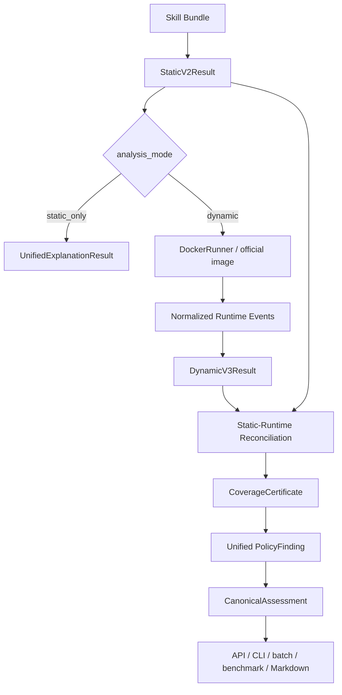

# ProvLoom System Hardening Report

## 1. 修改前系统不一致问题

修改前入口不是同一条事实链：API `static_only` 在 `app/backend/api.py` 旧路径中调用 legacy `analyze_static_skill()`，而不是 Static v2；dynamic API、dynamic CLI、batch、benchmark 分别手动调用 Docker、normalizer、`DynamicRuntimeAnalyzer`、`analyze_trace()` 和 telemetry report，容易重复构建 dynamic 结果。旧代码位置见 `app/backend/api.py:42-91` 的新主路径替换点；统一入口现位于 `app/analysis/pipeline.py:50-85` 和 `app/analysis/pipeline.py:88-152`。

修改前 report 输入也不统一：legacy JSON、dynamic artifacts、Static v2 markdown、batch report 各自拼字段。现在 `UnifiedExplanationResult` 是共同输入，模型定义在 `app/explanation/models.py`，构建在 `app/explanation/builder.py:50-107`，报告写入在 `app/reporting/unified_report.py:11-80`。

## 2. Canonical Pipeline

主函数：
- `app/analysis/pipeline.py:50-85` `analyze_skill_bundle()`：解析 skill，运行 `analyze_static_bundle()`，按模式进入 static-only 或 Docker runtime。
- `app/analysis/pipeline.py:88-152` `analyze_completed_execution()`：消费已有 `SandboxExecution`，只构建一次 normalized events 和 Dynamic v3 result。
- `app/analysis/pipeline.py:155-198` `_analyze_static_only()`：Static v2 为主结果，legacy static 仅放入 compatibility 字段。
- `app/analysis/pipeline.py:201-342` merge helpers：顶层 `risk_score/final_decision/canonical_*` 来自 canonical assessment，legacy 放入 `legacy_*`。

## 3. UnifiedExplanationResult Schema

结构定义在 `app/explanation/models.py`，schema version 为 `provloom-unified-v1`。核心字段包括 `static_result`、`dynamic_result`、`alignments`、`contradictions`、`aligned_paths`、`instruction_only_paths`、`runtime_only_paths`、`coverage_certificate`、`policy_findings`、`canonical_assessment`、`minimal_witnesses`、`limitations`、`legacy_compatibility`。

原始 Static/Dynamic payload 不被 builder 修改；统一条目只引用原始 id。构建入口在 `app/explanation/builder.py:50-107`，static/runtime items 提取在 `app/explanation/builder.py:130-184`。

## 4. Alignment 方法

分层对齐在 `app/explanation/builder.py:187-284`：
- entity：file/artifact/credential/endpoint/tool/process/data；
- action：READ/WRITE/EXECUTE/SEND/UPLOAD/DOWNLOAD/ACCESS_CREDENTIAL/INVOKE_API/PERSIST；
- path：static chain type 与 runtime chain semantic type。

匹配优先级在 `app/explanation/builder.py:257-284`：exact normalized identity、path/artifact identity、URL/domain、command executable、structured action compatibility、fuzzy weak evidence。fuzzy match 最高只给 0.69，不产生 `aligned`。

## 5. Contradiction 类型

正式 contradiction set 在 `app/explanation/builder.py:37-47`，实现条件在 `app/explanation/builder.py:287-328`：
1. `declared_local_only_but_runtime_network`
2. `declared_endpoint_mismatch`
3. `declared_auth_but_runtime_body_exposure`
4. `declared_artifact_identity_mismatch`
5. `required_confirmation_but_runtime_preconfirmation_action`
6. `declared_temporary_but_runtime_persistence`
7. `declared_read_scope_but_runtime_extra_sensitive_read`
8. `declared_tool_but_runtime_different_tool`
9. `declared_no_external_side_effect_but_runtime_external_effect`

Static 未提到某行为不会自动构造矛盾；claim 提取在 `app/explanation/builder.py:585-637`，只从明确 local-only、endpoint、auth、confirmation、temporary、read scope、tool、no-external-side-effect 表述产生 claim。

## 6. RuntimeObligation 和 CoverageCertificate

Coverage certificate 不再只看事件数。`RuntimeObligation` 定义在 `app/explanation/models.py`，生成在 `app/explanation/builder.py:372-433`，汇总在 `app/explanation/builder.py:331-369`。

状态解析在 `app/explanation/builder.py:436-462`。`target_reached_no_flow` 的严格条件在 `app/explanation/builder.py:465-478`：目标 action 到达、source/sink obligation 满足或不适用、carrier 可观测、无 TLS/instrumentation gap、无 confirmed/candidate flow。TLS payload 不可见时返回 `instrumentation_gap`。

## 7. SourcePolicy

默认 `/root/**` 已移除。显式 source rules 位于 `app/taint/source_registry.py:27-47`：
- `/etc/hosts` -> public/public_system_configuration
- `/etc/passwd` -> low/account_metadata
- `/etc/shadow` -> critical/system_secret
- SSH private key、cloud credentials、`.env` -> high/critical credential_secret
- `/root/.cache/**`、pip/npm/node cache -> public runtime_internal/package_cache
- `.provloom/private/**` -> high private_user_data

传播器消费 SourcePolicy 的位置是 `app/dynamic/propagation.py:32-40` 和 `app/dynamic/propagation.py:87-112`。只有 medium/high/critical source 会注册 runtime taint source；source rule、sensitivity、category 会写入 source metadata。

## 8. Unified PolicyFinding

PolicyFinding 定义在 `app/explanation/models.py`，生成在 `app/explanation/builder.py:481-552`：
- Static chain：`origin=static`，`evidence_status=instruction_supported`，通常进入 capability/review，不自动 runtime confirmed。
- Runtime policy violation：`origin=runtime`，`status=violation`，`evidence_status=runtime_confirmed`。
- Candidate chain、coverage gap、contradiction：映射为 review，不映射 benign。

Canonical assessment 收束在 `app/explanation/builder.py:555-582`；dynamic result 存在时复用 Dynamic v3 canonical assessment，并用 coverage/finding 语义防止 gap/candidate 被判 benign。

## 9. 报告统一

统一报告器在 `app/reporting/unified_report.py:11-80`。每次 canonical pipeline 输出：
- `unified-analysis.json`
- `unified-explanation.md`
- `canonical-analysis-result.json`

Markdown 标题按 canonical 状态选择：Violation Confirmed、Review Required、Execution Incomplete、No Violation Observed，逻辑在 `app/reporting/unified_report.py:83-93`。API schema 新增统一字段位置为 `app/backend/schemas.py:180-201`。

## 10. Docker Reproducibility

本轮未新增 eBPF/FUSE/TLS MITM。官方镜像 `skill-runtime-sandbox:dynamic-v3` 已重建成功：
- image id: `sha256:ae7dc432d769f34ab5822c1da7d3b499c3b8d5be1b94c0209de6eba89fc4ea00`
- smoke run: `OFFICIAL-DYNAMIC-V3-SMOKE2`
- result: exit_code 0, coverage `target_reached_no_flow`, sandbox image `skill-runtime-sandbox:dynamic-v3`

当前 `DockerRunner()`、API、Dynamic CLI、batch scan 和 benchmark runner 默认均使用 `skill-runtime-sandbox:dynamic-v3`；开发镜像可通过 `--image-name` 或 `PROVLOOM_SANDBOX_IMAGE` 覆盖。

## 11. Probe 结果

新增永久回归在 `test/test_unified_pipeline.py`：
- carrier probes 4/4：secret read no LLM prompt、trusted LLM prompt、trusted Authorization header、untrusted JSON body；
- source registry probes：`/etc/hosts`、`/root/.cache`、`/etc/shadow`、`.env`、SSH key；
- contradiction 正/反例：9 种 contradiction 均覆盖；
- coverage probe：TLS gap 不允许 `target_reached_no_flow`；
- API static_only probe：确认 Static v2 和 unified output。

Key-only leakage scan 对 `app test scripts docs artifacts` 无真实 API key 命中。两个旧 artifact `llm-config.json` 中发现的明文 key 已 redacted。

## 12. 测试结果

- `python3 -m unittest discover -s test -p 'test_unified_pipeline.py'`: 6 passed
- `python3 -m unittest discover -s test -p 'test_dynamic*.py'`: 49 passed
- `python3 -m unittest discover -s test -p 'test_static*.py'`: 53 passed
- `python3 -m unittest discover -s test -p 'test_*.py'`: 163 passed, 0 failed, 0 errors
- `python3 -m compileall app test scripts`: passed
- Docker official smoke: passed with explicit dynamic-v3 image

## 13. 当前已知限制

1. Alignment 仍是 evidence-key/semantic compatibility 级，不是 inode/FD/object identity 级。
2. RuntimeObligation 由 static actions/chains 自动生成，尚未接入完整 trigger plan schema 和 external-state health checker。
3. strace 仍会产生大量 Python/runtime internal file events；统一 alignment 已分出 `internal_unresolved`，但底层 trace/graph 仍保留完整噪声。
4. official image metadata 依赖 Docker label 与 `/artifacts/runtime-build-info.json`；旧镜像缓存缺少新 label 时仍以 artifact build info 为准。
5. 无 TLS plaintext、无 eBPF/FUSE、无 byte-level DIFT，payload 不可见时只能给 instrumentation gap。

## 14. 下一阶段 Benchmark 建议

1. 在 benchmark manifest 中单独统计 canonical status、coverage certificate、policy finding，而不是只看 legacy final_decision。
2. 将 official image tag 作为 benchmark runner 显式参数并记录 image id/source fingerprint。
3. 增加 alignment quality 指标：entity/action/path aligned、runtime-only、instruction-only、contradiction 各自计数。
4. 对 runtime internal noise 加白名单裁剪，但不要裁掉 sensitive source/path evidence。
5. 将 Docker E2E probe 与 mock LLM service 固化，避免真实模型 API 影响 reproducibility。
